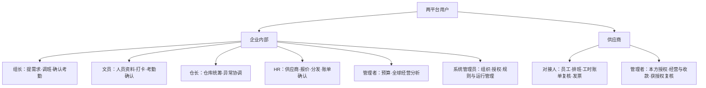

# 角色功能地图｜全球劳务工管理与供应商协同

版本：V2.0｜与 [spec.md](./spec.md)、[系统功能地图](./system-function-map.md) 配套。

已确认：组长／文员先确认考勤，随后供应商复核，无固定截止；HR 确认账单后供应商复核并提交发票。其余授权为建议基线；“完整功能”不等于所有角色均可操作所有功能。

## 系统标识与消息中心（2026-09-14 已确认）

- 内部系统统一命名 **OTWS**，采用[紫色任务核对标识](./global-workforce-prototype/otws.svg)；外部系统统一命名 **LABOR DISPATCHING**，采用[蓝色双向派遣标识](./global-workforce-prototype/labor-dispatching.svg)。登录页、顶部品牌、侧栏、浏览器标题、旅程入口和文档保持一致。
- 顶部只有一个 **消息中心** 入口，同时显示“待办 N”和“通知 M”。N 为当前身份未办理事项数，M 为当前身份未读通知数；待办计数视觉优先，不能合并为一个总数。
- 消息中心一级页签为 **待办／通知**。待办下分 **待办／已办**；通知下提供 **全部／未读／已读** 筛选，每条通知明确标记已读或未读。
- 查看待办、阅读通知或标记已读都不完成业务任务。只有完成规定业务动作才进入已办，保留处理人、时间、动作和结果。
- 通知支持标为已读、标为未读、全部标为已读；仅更新当前身份阅读状态及入口通知数量，不改变待办数量或交易状态。两个系统和不同角色的阅读状态分别保存。
- 消息范围服从当前业务授权；侧栏、全部菜单、工作台入口及旧通知链接统一指向同一个消息中心，不再打开独立通知抽屉。

## 角色地图

仓长不是考勤必经审批人；组长和文员不是两个串行审批节点。两者按范围任一获授权者确认即可；若未来按仓分工，仍不增加未确认的审批层级。

## 角色—功能权限矩阵

“办理”含新增、提交和修正，但不等于批准；“确认”为业务生效权；“查看”为只读；“授权后”须另获具体权限；“—”表示该角色无默认权限。所有动作均受数据范围约束。

| 功能／系统模块 | 组长 | 文员 | 仓长 | 企业 HR | 管理者 | 系统管理员 | 供应商对接人 | 供应商管理者 |
| --- | --- | --- | --- | --- | --- | --- | --- | --- |
| 消息中心／L-01 S-01 | 办理 | 办理 | 办理 | 办理 | 查看／获授权处理 | 管理类办理 | 办理 | 办理 |
| 供应商准入／L-02 S-02 | — | 查看合作状态 | 查看 | 审核办理 | 查看 | — | 提交资料 | 提交／管理本方资料 |
| 合作合同／L-03 S-02 | — | — | 查看适用条款 | 办理；批准另授权 | 查看；批准另授权 | — | 查看／提交补正 | 查看／提交变更 |
| 报价／L-03 S-03 | — | — | 授权后查看 | 办理；批准另授权 | 查看；批准另授权 | — | 提交本方报价 | 提交／查看本方报价 |
| 供应商账户／L-04 S-11 | — | — | — | 开停及范围授权 | — | 授权治理 | 个人偏好 | 管理本方成员 |
| 需求申请／L-05 | 提交／变更 | 协助办理 | 查看协调 | 核对／退回 | 查看 | — | — | — |
| 需求分发／L-05 S-04 | 查看 | 查看 | 查看协调 | 分发／调整 | 查看 | — | 查看本方／反馈 | 查看本方／反馈 |
| 人员档案／L-06 S-05 | 查看必要信息 | 核验办理 | 查看必要信息 | 核验办理 | 汇总查看 | — | 维护本方 | 维护本方 |
| 到场试工／L-06 S-05 | 记录结果 | 记录结果 | 查看协调 | 查看／纠错授权 | 汇总查看 | — | 提交／查看本方结果 | 查看本方 |
| 资格培训／L-06 S-05 | 查看所需资格 | 核验记录 | 查看协调 | 核验／规则批准授权 | 汇总查看 | 配置已批准规则 | 提交本方资料 | 管理本方资料 |
| 排班调动／L-07 S-04 | 确认／调整本组 | 授权后确认／调整 | 确认／调整本仓 | 查看协调 | 汇总查看 | — | 提报本方安排 | 授权后提报 |
| 请假替班加班／L-07 S-04 | 按规则确认 | 协助办理 | 授权后确认 | 查看／例外授权 | 汇总查看 | — | 提交及补充 | 授权后提交 |
| 打卡权限／L-08 | 查看状态 | 开关办理／核查 | 查看协调 | 开关办理／核查 | — | 外部状态核查 | 查看本方必要状态 | 查看本方必要状态 |
| 打卡与异常／L-08 L-09 | 核对／更正 | 核对／更正 | 查看协调 | 查看协调 | 汇总查看 | 来源异常核查 | 提交本方依据 | 查看本方 |
| 内部考勤确认／L-09 | 确认 | 确认 | 查看协调 | 查看协调 | 汇总查看 | — | — | — |
| 供应商工时复核／L-10 S-06 | 处理异议 | 处理异议 | 协调 | 查看协调 | 汇总查看 | — | 授权后确认／异议 | 授权后确认／异议 |
| 周期及币种协议／L-03 L-11 | — | 查看适用周期 | 查看适用周期 | 办理／批准授权 | 查看 | 配置已批准规则 | 查看本方／提变更 | 查看本方／提变更 |
| 账单准备／L-11 | — | 授权后核对依据 | 查看本仓获准费用 | 生成／核对／修正 | 查看 | — | 查看本方已发布账单 | 查看本方已发布账单 |
| 企业账单确认／L-11 | — | — | — | 确认／退回 | 查看 | — | — | — |
| 供应商账单复核／S-07 | — | — | — | 处理异议 | 查看 | — | 授权后确认／异议 | 授权后确认／异议 |
| 发票及调整／L-12 S-08 | — | — | — | 核对／退回／调整办理 | 查看汇总 | — | 授权后提交／修正 | 授权后提交／修正 |
| 自动报账异常／L-12 | — | — | — | 核查／补正／继续处理 | 查看汇总 | 运行异常处理 | 补充本方资料 | 查看／补充本方资料 |
| 付款进度／L-13 S-09 | — | — | 授权后查看 | 查看／核查 | 查看 | 来源状态核查 | 查看本方 | 查看本方 |
| 收款资料／L-13 S-09 | — | — | — | 授权后复核 | — | — | 授权后提交变更 | 授权后提交变更 |
| 预算成本／L-14 | 查看本组获准预算 | — | 查看／申请本仓预算 | 编制／核对 | 授权后批准 | — | — | — |
| 经营分析／L-15 S-10 | 本组查看 | 授权仓库查看 | 本仓查看 | 授权企业查看 | 授权全球范围查看 | — | 本方获准明细 | 本方汇总与明细 |
| 全球规则／L-16 | 查看适用规则 | 查看适用规则 | 提供本仓需求 | 提供／批准授权 | 业务政策批准授权 | 维护已批准规则 | 查看合作适用规则 | 查看合作适用规则 |
| 内部权限／L-16 | — | — | 提范围申请 | 提范围申请 | 授权后批准 | 管理 | — | — |
| 业务导入导出／G-07 | 本组获准资料 | 获准资料 | 本仓获准资料 | 获准业务 | 获准分析 | 迁移核查授权 | 本方获准资料 | 本方获准资料 |
| 操作追溯／G-05 | 本人及获准业务 | 本人及获准业务 | 本仓获准业务 | 获准业务 | 授权汇总 | 授权治理记录 | 本方获准业务 | 本方获准业务 |

## 每个角色的完整工作范围

| 角色 | 核心旅程 | 关键产出 | 数据边界与禁止动作 |
| --- | --- | --- | --- |
| 组长 | 提需求→查看安排→确认实际班次→核对异常→确认考勤→处理供应商工时异议 | 真实需求、班次及内部确认结果 | 授权组；不能确认供应商账单或修改财务付款 |
| 文员 | 核验名单／到场→办理打卡→整理排班与事实→核对并确认考勤→修正异议 | 人员及打卡可核对、内部确认结果 | 授权仓库／组；不是组长之后的必经审批人 |
| 仓长 | 查看需求与缺口→协调人员班次→监督积压与异常→查看本仓分析 | 仓库统筹及问题处理安排 | 不默认拥有考勤最终确认权；不能替代 HR 账单确认 |
| 企业 HR | 准入合同报价→授权供应商→分发需求→跟进人员与争议→周期出账→确认账单→报账异常→付款核查 | 有效合作、分配任务、有效企业账单及报账跟进 | 仅授权主体；收款资料和报价批准可单独授权 |
| 管理者 | 查看跨地区规模、履约、留存、预算成本与账龄→识别差异→授权范围内政策决策 | 可追溯经营判断和获授权预算决策 | 集团权限需明确；不因职位自动获得所有个人资料或交易修改权 |
| 系统管理员 | 组织与权限→配置已批准规则→外部数据异常→迁移与恢复核对→授权及资料策略 | 系统治理和可信运行状态 | 不代替 HR、组长／文员或供应商作业务确认，不直接修改财务事实 |
| 供应商对接人 | 收需求→维护员工→提报安排→复核工时→复核 HR 账单→提交发票→查看收款 | 本方交付、确认及开票资料 | 本供应商获准合作范围；工时／账单／发票权限可分别授权 |
| 供应商管理者 | 管理成员→管理合作资料→查看履约与收款→获授权复核或争议处理 | 本方权限、经营监督及确认结果 | 不能自行扩展企业授权；与对接人不构成默认两层串行复核 |

## 关键确认权与外部边界

| 阶段 | 办理／发起 | 必需确认方 | 下一责任方 |
| --- | --- | --- | --- |
| 需求 | 组长 | HR 核对并分发；额外预算授权按规则 | 供应商 |
| 人员安排 | 供应商 | 企业获授权排班人员 | 现场用工人员 |
| 考勤 | 组长／文员核对 | 组长或文员任一获授权者 | 供应商工时复核人 |
| 工时 | 供应商复核人 | 本供应商获授权者 | 系统按周期生成账单／HR |
| 账单 | 账单生成及 HR 核对 | 先 HR，再本供应商获授权者 | 供应商发票经办 |
| 发票与报账 | 供应商提交 | 依协议校验／审票条件；满足后自动发起 | 内部报账流程 |
| 付款 | 内部财务流程 | 外部财务实际审批和付款确认 | 两端获准用户查看 |

财务审批人不是本次两平台新增用户角色，沿用内部流程；不能给系统管理员一个“标记已付款”权限替代财务事实。劳务工本人仍为管理对象，未新增其登录入口。

## 权限验收重点

1. 组长或文员确认一次即可流转，不能再要求仓长必审；未内部确认的工时不能由供应商确认。
2. 无固定考勤截止，不因周／双周／月关账而禁止后续核对，晚确认按原周期补结。
3. 对接人无结算权限时可安排人员，但不能确认工时／账单或提交发票；管理者必须明确授权后操作。
4. 企业 HR 不能代替供应商确认；供应商管理者不能给本方成员增加企业未授权范围。
5. 所有查看、下载、汇总、附件和批量动作遵守同一范围；管理员管理权限不等于明文个人资料访问权。
6. 代理授权到期即失效，历史记录保留实际操作者及代理关系；旧内容确认不得覆盖新内容。

自检：每个角色、矩阵单元及流程动作均定义业务权限与责任，替换技术栈仍成立；未绑定页面、服务或数据库。默认授权与地区责任人在业务评审时确定。
