# 系统功能地图｜全球劳务工管理与供应商协同

版本：V2.0｜与 [spec.md](./spec.md) 配套。完整功能范围，不按开发工期裁剪。模块是业务能力分组，不代表部署架构或固定菜单。

## 系统标识与消息中心（2026-09-14 已确认）

- 内部系统统一命名 **OTWS**，采用[紫色任务核对标识](./global-workforce-prototype/otws.svg)；外部系统统一命名 **LABOR DISPATCHING**，采用[蓝色双向派遣标识](./global-workforce-prototype/labor-dispatching.svg)。登录页、顶部品牌、侧栏、浏览器标题、旅程入口和文档保持一致。
- 顶部只有一个 **消息中心** 入口，同时显示“待办 N”和“通知 M”。N 为当前身份未办理事项数，M 为当前身份未读通知数；待办计数视觉优先，不能合并为一个总数。
- 消息中心一级页签为 **待办／通知**。待办下分 **待办／已办**；通知下提供 **全部／未读／已读** 筛选，每条通知明确标记已读或未读。
- 查看待办、阅读通知或标记已读都不完成业务任务。只有完成规定业务动作才进入已办，保留处理人、时间、动作和结果。
- 通知支持标为已读、标为未读、全部标为已读；仅更新当前身份阅读状态及入口通知数量，不改变待办数量或交易状态。两个系统和不同角色的阅读状态分别保存。
- 消息范围服从当前业务授权；侧栏、全部菜单、工作台入口及旧通知链接统一指向同一个消息中心，不再打开独立通知抽屉。

## 总体功能地图

```mermaid
flowchart TB
  ROOT[全球劳务用工与供应商协同]
  ROOT --> L[OTWS]
  ROOT --> S[LABOR DISPATCHING]
  ROOT --> G[两平台共用业务能力]
  L --> L1[工作台·消息中心·经营分析]
  L --> L2[供应商准入·合同·报价·账户]
  L --> L3[需求申请·分发·缺口]
  L --> L4[人员全生命周期]
  L --> L5[排班·请假·替班·加班]
  L --> L6[打卡权限·记录·规则计算]
  L --> L7[T+1 组长／文员确认]
  L --> L8[周期账单·HR 确认·预算]
  L --> L9[发票核对·自动报账·财务进度]
  S --> S1[工作台·消息中心·本方分析]
  S --> S2[合作资料·合同·报价协同]
  S --> S3[需求响应·人员安排]
  S --> S4[人员档案·资格·异动]
  S --> S5[工时复核·争议处理]
  S --> S6[账单复核·发票·费用调整]
  S --> S7[收款资料·审批付款查询]
  S --> S8[本方成员与授权]
  G --> G1[国家地区·组织·时区·语言]
  G --> G2[周／双周／月等周期·九币种]
  G --> G3[地区业务规则与生效管理]
  G --> G4[权限·代理·隐私·操作追溯]
  G --> G5[待办·催办·资料·批量处理]
  G --> G6[外部数据核对·异常恢复]
```

## OTWS：功能目录

| 模块 ID | 一级模块 | 二级功能与主要操作 | 主要业务对象／产出 | Spec |
| --- | --- | --- | --- | --- |
| L-01 | 工作台 | 消息中心（待办／通知）、待办／已办、未读／已读、团队积压、主动催办、通知、快捷查找；考勤仅展示等待时长 | 待办及当前责任方 | AC-13 |
| L-02 | 供应商管理 | 准入申请审核、合作范围、联系人、资格、暂停／恢复、退出、整改 | 有效供应商及合作状态 | AC-01、18 |
| L-03 | 合同与报价 | 合作协议、续签变更、报价征集、比较、批准、生效；费率、税口径、付款条件 | 有效协议和适用报价 | AC-02、18 |
| L-04 | 协同账户 | 创建／停用供应商账户、角色、合作范围、成员授权边界 | 供应商可用权限 | AC-01、14 |
| L-05 | 用工需求 | 组长申请、HR 核对／退回、分配供应商、调减／取消、缺口跟进 | 需求、分配任务、安排进度 | AC-03 |
| L-06 | 人员管理 | 名单核验、到场、试工、结果、入场、培训资格、在岗、离场、再次入场、历史派遣 | 人员身份及多次派遣关系 | AC-05、19 |
| L-07 | 排班调度 | 确认供应商安排、调整班次、冲突处理、替班、请假、加班、调组／仓、人员匹配 | 实际有效安排 | AC-04、19 |
| L-08 | 打卡管理 | 权限开通／失效、结果核对、记录查看、重复识别、补卡依据、来源异常 | 打卡事实及权限结果 | AC-05、06 |
| L-09 | 考勤管理 | 当地规则、跨日／休息／加班计算、异常修正、组长／文员确认、退回重核 | 内部已确认考勤 | AC-06、07 |
| L-10 | 工时争议 | 供应商异议、证据核对、修正、再次复核、批量处理 | 双方确认工时及争议历史 | AC-08 |
| L-11 | 周期结算 | 周／双周／月／其他周期、协议日历、费用汇总、HR 确认／退回、补结、冲减、周期切换 | 当前有效账单 | AC-09、15、16、22 |
| L-12 | 发票与报账 | 账票分配、资料匹配、审票要求、分批／整单报账、去重、失败核查、退回补正 | 有效报账与费用占用 | AC-11、23 |
| L-13 | 审批付款 | 审批进度、部分付款、付款失败、原币核销、差额、收款资料复核 | 财务可信进度及未付金额 | AC-12、16、23 |
| L-14 | 预算与成本 | 成本中心、预算、预计与实际、超预算处理、原币成本、集团折算 | 预算差异及费用归属 | AC-16、22 |
| L-15 | 经营分析 | 需求漏斗、满足率、供应商履约、人员规模、留存、考勤、争议、账龄、成本、明细核对 | 按国家／企业／仓库等范围的分析 | AC-13、20 |
| L-16 | 全球系统管理 | 组织地区、语言时区、规则授权、内部角色代理、资料策略、导入导出、外部状态、恢复核对 | 授权及可追溯业务配置 | AC-14、17、21 |

## LABOR DISPATCHING：功能目录

| 模块 ID | 一级模块 | 二级功能与主要操作 | 主要业务对象／产出 | Spec |
| --- | --- | --- | --- | --- |
| S-01 | 工作台 | 消息中心（待办／通知）；新需求、待修正安排、待复核工时／账单、待补发票、收款动态、主动催办 | 本供应商待办 | AC-13 |
| S-02 | 企业资料与合作 | 本方资料、联系人、服务范围、资格提交、补正、合同查看／续期资料、整改 | 合作资料及审核结果 | AC-01、18 |
| S-03 | 报价协同 | 收到征集、填写报价、变更提交、查看批准版本及周期币种 | 本供应商报价 | AC-02、18 |
| S-04 | 需求与排班 | 需求查看、人数反馈、缺口说明、名单与班次提报、替补、变更处理 | 拟执行安排 | AC-03、04 |
| S-05 | 员工管理 | 本方档案、资格、提报、到场结果、入离场、异动、再次派遣 | 本方人员和派遣关系 | AC-05、19 |
| S-06 | 工时复核 | 内部确认结果、必要依据、逐项／批量确认、具体异议、修正后再次确认 | 供应商工时确认 | AC-08 |
| S-07 | 账单复核 | 已获 HR 确认账单、周期／币种筛选、明细核对、确认／异议、补结／冲减 | 供应商账单确认 | AC-09、10、15、16 |
| S-08 | 发票管理 | 提交凭证、账票分配、补齐、撤换／冲减、被退回资料修正 | 可报账费用凭证 | AC-11、23 |
| S-09 | 收款协同 | 收款资料维护、企业复核结果、报账进度、部分付款、差额与未收金额 | 收款状态及待跟进事项 | AC-12、16、23 |
| S-10 | 本方经营分析 | 分配与履约、在岗／留存、工时、争议、原币费用、账龄和收款 | 本方获准业务汇总 | AC-20 |
| S-11 | 成员与偏好 | 本方成员、授权、代理、停用、语言时区与通知偏好、资料处理申请 | 企业授权内的本方管理 | AC-01、17、21 |

## 两平台共用业务能力

| ID | 能力 | 必须体现的规则 | Spec |
| --- | --- | --- | --- |
| G-01 | 全球组织及本地化 | 法定企业与经营地区分开；当地时区、夏令时、日历、语言和数字格式 | AC-17 |
| G-02 | 结算日历 | 周、双周、月及自定义；锚点、跨期、周期变更、补结；不限制考勤确认时间 | AC-15 |
| G-03 | 金额与币种 | USD、GBP、EUR、CZK、PLN、JPY、KRW、CAD、AUD；原币／折算分开 | AC-16 |
| G-04 | 地区规则 | 工时、资格、费用、发票和资料规则的范围、生效及批准 | AC-02、06、17 |
| G-05 | 权限与追溯 | 企业／供应商隔离、角色动作权限、代理、敏感授权及历史 | AC-14、21 |
| G-06 | 消息中心与协同 | 共用入口，两类计数；待办／已办与通知已读／未读；当前状态、责任方、等待时长、主动催办；不设考勤逾期自动审批 | AC-07、13 |
| G-07 | 资料与批量操作 | 附件可见性、导入核对、逐项错误、批量确认前提、资料保留 | AC-04、11、21 |
| G-08 | 外部业务衔接 | 打卡、权限、组织人员、内部报账、审批付款及汇率事实核对、失败处理 | AC-05、11、12、16、21 |

## 跨平台关键交接地图

F、G 无硬性截止，不因周期结束自动通过或禁止补确认。退回导致工时变化时必须回到工时确认；仅发票变化不重开无变化的账单确认。所有结算调整追溯原费用，防止重复占用。

## 范围与完整性

完整覆盖供应商准入至退出、需求至离场、考勤至付款、全球基础设置及经营分析。工资发放、银行清算和非劳务采购仍属产品职责之外，不因“完整”复制第三方系统。实际地区规则和语言清单待业务明确，但能力纳入设计。

自检：L-01～16、S-01～11、G-01～08 及交接动作均描述业务能力和结果，替换技术栈仍成立。角色授权详见 [角色功能地图](./role-function-map.md)。
