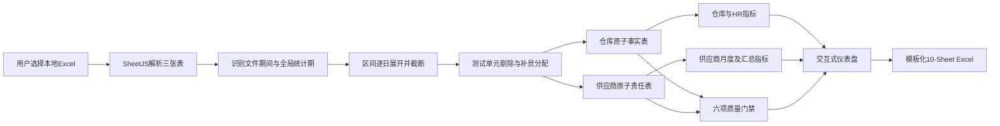

# 供应商履约率分析工具：技术方案与交接文档

> 文档版本：v2026.08.06  
> 适用项目：OTWS 用工需求池供应商履约率分析、仪表盘与 Excel 报表导出  
> 当前应用：供应商履约率分析台  
> 当前代码目录：`/Users/hillhoang/Desktop/门户系统/需求满足率统计/需求满足率分析/供应商履约率看板工具`  
> 线上地址：<https://ztn.feishuapp.com/app/app_17agfbtrwqs>  
> 本文定位：接手开发、复算、审计、发布时的唯一主文档。历史聊天和旧报表只能作为背景，不能覆盖本文记录的现行实现与风险边界。

## 0. 一页结论

本工具是一个纯前端、浏览器本地计算的静态 HTML 应用。用户上传一个月、连续多个月或跨年度的 OTWS“用工需求池”Excel 后，工具会：

1. 读取【基本信息】【需求详情】【发单详情】三张表；
2. 将日期区间按“每天 N 人”逐日展开为人日；
3. 在“区域×仓库×组×日期×工种×班次”原子单元上，清洗测试记录、并入有效补员、封顶满足量并分配超发责任；
4. 生成供应商、工种、运营区域、大区和全局层级的仪表盘；
5. 导出含 10 个工作表、完整底表、公式链、图表、对账与源文件 SHA-256 的 Excel 报表；
6. 按上传范围自动命名，例如“英国供应商履约率报表”“美洲亚太供应商履约率报表”“全球供应商履约率报表”。

当前已经确定并实现的指标分工是：

| 指标 | 定位 | 回答的问题 |
|---|---|---|
| 原始接单兑现率 | 供应商主指标 | 供应商对实际收到的发单兑现了多少 |
| 超发校正履约率 | 公平性对照，不替代主指标 | 剥离 HR 在原子单元上超发后，供应商对合理责任兑现了多少 |
| 仓库真实满足率 | 仓库结果指标 | 仓库真实人力需求最终满足了多少 |
| 发单覆盖率及超发/少发 | HR 发单质量 | HR 是否把真实需求正确、充分地分配出去 |

截至 2026-08-06，真实欧洲、美洲亚太和全球组合数据的计算、导出、跨区域公式、桌面/移动端浏览器流程均通过回归；全球报表的 140,419 个公式在删除缓存后由 LibreOffice 独立重算，实质差异为 0。

但如果结果要直接进入 2026 年供应商盘点评分，仍有两个 P0 治理/实现问题：

1. **无有效分母月份的评分规则已确认、但尚未实现。**业务负责人已明确：纳入本次盘点的供应商，在所选统计月份内若某月无有效发单分母，该月评分按 `0%` 并计入月度算术平均。当前生产实现仍显示“—”且排除该月，因此现有月均只能作为观察口径，不能直接作为最终盘点评分。
2. **机制文件中的“工时权重校正”尚未接入。**当前“超发校正履约率”是超发责任模型，不等于《劳务供应商盘点优化》中“原始需求满足率×工时权重”的校正需求满足率。

因此，当前版本对分析、诊断和生成可追溯报表是可用的；用于正式供应商评分时应标记为 **Share with caveats**，先实现无分母月份的独立评分字段，并完成工时权重规则签字后再固化评分结果。

## 1. 业务背景与需求演变

### 1.1 为什么开发这个工具

项目服务于 2026 年 FBU 海外劳务供应商盘点。管理机制要求优化供应商池、按 A/B/C/D 分级，并将等级与后续用工需求配额和供应商退出机制关联。

业务依据主要来自：

- `/Users/hillhoang/Desktop/门户系统/供应商管理/纵腾集团FBU海外交付前台劳务供应商管理机制-2026版-V202601.xlsx`
- 第 3 张表【3、劳务供应商盘点优化】明确：人员供给占 60%，其中“劳务工需求满足率”占 30%，按 4、5、6 月平均，并提出“原始需求满足率×工时权重=校正需求满足率”。
- `/Users/hillhoang/Desktop/门户系统/门户资料/` 下的 OTWS/供应商门户需求说明、设计概要和 HR/仓库/供应商操作手册，用于理解需求、发单、派遣三段业务链。

本工具不负责完整供应商评分、271 分布或订单配额分配；它只负责提供供应商供给表现、仓库保障结果和 HR 发单质量的可审计基础数据。

### 1.2 最初需求与关键纠偏

项目不是一次性按固定公式完成的，而是经过多轮对抗性审查后收敛：

1. **最初想法：两版满足率。**一版以供应商发单为分母，一版以仓库需求为分母。
2. **第一性原理纠偏：仓库需求不能直接作为每家供应商的分母。**一个仓库单元通常同时发给多家供应商；若每家都承担全部仓需，分母重复；若用全区需求作分母，得到的是贡献份额，不是履约率。
3. **真正目标被重新表述。**需要识别“如果 HR 没有超发，这家供应商合理应承担多少”，因此建立按发单占比缩减超发责任的对照模型。
4. **日期区间纠偏。**明细中 `2026-06-17~2026-06-30` 的含义是区间内每天 N 人，不能只取首日，也不能只按一行计 N 人。旧解析曾因此在 6 月少计需求 321、发单 289、派遣 268 人日。
5. **测试单元纠偏。**测试供应商所在完整原子单元的需求、补员、发单、派遣都应剔除，不能只删供应商分子却残留仓需分母。
6. **小数解释纠偏。**原始需求、发单、派遣是事实人日；按比例折算出的合理责任可以是小数，它是“责任人日等值”，不是小数个人。
7. **Excel 公式纠偏。**跨区域公式曾缺少完整括号，浏览器写入的缓存值正确，但 WPS/LibreOffice 重算会得到数十万百分比。现已增加静态公式门禁和删除缓存后的独立重算。
8. **范围扩展。**工具从欧洲 4-6 月固定场景扩展到任意连续时间区间、单区域、欧洲、美洲、亚太、美洲亚太和全球数据。

### 1.3 已确认的业务决策

以下是目前应视为已确认的规则：

- 原始接单兑现率是供应商主指标；超发校正履约率是对照。
- 只有原子单元总发单大于真实需求时才缩减供应商责任；少发时不能把 HR 尚未发出的需求转嫁给供应商。
- 每个原子单元内的有效兑现最多为 100%，不能用某天、某仓、某工种的超额派遣抵消另一处缺口。
- 需求为 0 但仍发单的记录保留在原始兑现率和异常清单中；校正责任为 0，不进入仓需分母。
- 仓库真实满足率、发单覆盖率、超发、少发和冗余派遣用于判断仓库保障和 HR 分配质量，不用于替代供应商履约率。
- 超发按发单占比分配只是当前数据条件下的中性模型，不能证明 HR 实际把“多余订单”具体发给了哪一家供应商。

## 2. 概念、单位与责任边界

### 2.1 人日

人日是“人数×天数”的工作量单位，不是去重后的人头数：

- 1 人工作 1 天 = 1 人日；
- 10 人工作 1 天 = 10 人日；
- 2 人连续工作 5 天 = 10 人日；
- 同一个人连续工作 10 天 = 10 人日，但唯一人数仍是 1 人。

例如“2026-06-21~2026-06-29，需求 10”代表 9 天每天需要 10 人，即 90 需求人日。

### 2.2 三类量必须分开

| 类型 | 示例 | 是否应为整数 | 含义 |
|---|---|---:|---|
| 源事实人日 | 需求、补员、发单、派遣 | 原则上是 | OTWS 记录的实际业务量 |
| 封顶有效人日 | 有效兑现、仓库有效满足、发单覆盖 | 原则上是 | 在原子单元内对源事实取 `min` 后的可计量结果 |
| 模型责任人日等值 | 合理责任、校正兑现、释放责任 | 可以是小数 | 按超发因子比例折算的责任份额，不是实际人头 |

若原始需求、发单或派遣出现非整数，应优先检查源数据或浮点精度，不应直接解释为“小数个人”。

### 2.3 原子颗粒度

所有封顶、超发判断和责任分配都必须先在以下颗粒度完成：

```text
区域 × 仓库 × 组 × 日期 × 工种 × 班次
```

供应商责任底表再增加：

```text
供应商ID × 供应商名称
```

先月度汇总再封顶是错误的，因为一个单元的超供不能补偿另一个单元的缺口。

## 3. 指标定义

设原子单元为 `u`，供应商为 `s`：

- `D_u`：真实需求人日 = 基础需求 + 有效补员；
- `O_u`：单元总发单人日；
- `P_u`：单元总派遣人日；
- `O_us`：供应商发单人日；
- `P_us`：供应商派遣人日。

### 3.1 原始接单兑现率（主指标）

```text
供应商原始有效兑现 E_raw_us = min(P_us, O_us)

原始接单兑现率
= Σ E_raw_us ÷ Σ O_us
```

解释：供应商实际收到多少订单，就对多少订单承担直接兑现责任。供应商派遣超过自身发单的部分不跨单元抵扣。

### 3.2 超发校正履约率（对照）

```text
责任因子 f_u =
  0                              当 O_u = 0
  min(1, D_u ÷ O_u)              当 O_u > 0

供应商合理责任 R_us = O_us × f_u

供应商校正有效兑现 E_adj_us = min(P_us, R_us)

超发校正履约率
= Σ E_adj_us ÷ Σ R_us
```

含义：

- 当 `O_u <= D_u`，`f_u = 1`，供应商合理责任等于实际发单；
- 当 `O_u > D_u`，真实需求按各供应商发单占比缩减；
- 当 `D_u = 0` 且仍有发单，合理责任为 0，但原始发单和派遣仍保留在主指标与异常清单；
- 校正率是对 HR 超发影响的敏感性分析，不是“机械加分”。汇总后可能低于原始率，因为高履约超发单元的权重被下调。

模型边界：只有原始配额、供应商确认接单量、发单优先级或发单时间戳才能事实性判断“哪家被超发”。当前比例模型只能中性分摊责任。

### 3.3 仓库真实满足率

```text
仓库有效满足 E_wh_u = min(P_u, D_u)

仓库真实满足率
= Σ E_wh_u ÷ Σ D_u
```

该指标评价仓库是否最终缺人，不能直接评价单家供应商。

### 3.4 HR 发单质量

```text
发单覆盖人日       = min(O_u, D_u)
发单覆盖率         = Σmin(O_u, D_u) ÷ ΣD_u
正需求超发人日     = max(O_u - D_u, 0)，仅 D_u > 0
少发人日           = max(D_u - O_u, 0)
零需求发单人日     = O_u，D_u = 0
冗余派遣人日       = max(P_u - D_u, 0)；D_u = 0 时等于 P_u
实际发单/真实需求  = ΣO_u ÷ ΣD_u
实际派遣/真实需求  = ΣP_u ÷ ΣD_u
```

其中“实际发单/真实需求”和“实际派遣/真实需求”允许超过 100%，因为它们是风险比率，不是封顶满足率。

### 3.5 月度、算术平均与累计加权

当前生产实现：

- 每月比率：当月先汇总分子、分母，再相除；不是对明细百分比求平均。
- 月度平均：对有有效分母的月度比率做算术平均。
- 统计期累计加权：统计期累计分子 ÷ 统计期累计分母。
- 分母为 0：显示“—”；有分母但有效兑现为 0：显示 `0%`。

算术平均回答“典型月份表现如何”；累计加权回答“整个统计期按业务量加权后表现如何”。两者都保留，不能互相替代。

#### P0 实现差距：无有效分母月份

业务负责人已确认：对于纳入本次盘点的供应商，统计期覆盖的每一个月份都进入评分；某月无有效发单分母时，该月评分按 `0%`，并参与月度算术平均，避免只保留活跃月份而系统性抬高盘点评分。

第一性原理上，`0/0` 在数学事实层仍是未定义，不等于履约失败。因此必须保留两层字段：

```text
观察履约率：分母为0 -> 无数据
评分月度履约率：分母为0 -> 按已确认政策插补0
```

当前生产版本只实现了第一层：显示“—”且不参与月均；第二层尚未编码，属于正式盘点评分前的 P0 实现差距。评价对象集合应优先来自正式盘点名单；若没有独立名单，再以统计期内至少一个月出现有效供应商主体记录为回退。系统应为评价对象补齐全部统计月份后生成评分月均，不得覆盖观察口径，也不得把评分插补值写回事实底表。

### 3.6 与机制文件“工时权重校正”的关系

机制文件的“原始需求满足率×工时权重=校正需求满足率”与本工具的“超发校正履约率”是两件事：

- 工时权重校正：盘点评分层的业务加权，需要额外工时权重数据和明确算法；
- 超发校正：本工具在订单责任层剥离 HR 超发，用于公平性对照。

当前工具没有工时权重输入、映射和评分公式。接手人不得把“超发校正率”直接改名为“机制校正需求满足率”。若要接入，应在现有事实指标之后增加独立评分层，并保存权重来源、版本和生效日期。

## 4. 数据源与输入契约

### 4.1 当前真实验证数据

欧洲数据目录：

```text
/Users/hillhoang/Desktop/门户系统/需求满足率统计/欧洲4月-6月需求满足率/
```

包含 7 个文件：4.1-4.15、4.16-4.30、5.1-5.15、5.16-5.30、5.31、6.1-6.15、6.16-6.30。

美洲亚太数据目录：

```text
/Users/hillhoang/Desktop/门户系统/需求满足率统计/美洲亚太4月-6月需求满足率/
```

同样包含 7 个相应期间文件。当前亚太真实样本只有澳洲区，因此“已适配亚太”指代码映射和全球组合流程已支持，不代表日本、新加坡等每个区域都有真实回归样本。

### 4.2 每个工作簿必须包含三张表

| 工作表 | 颗粒度 | 主要用途 |
|---|---|---|
| 基本信息 | 区域×仓库×组×日期 | 仓库日总量、补员、三表对账、文件期间识别 |
| 需求详情 | 区域×仓库×组×需求日期×工种×班次 | 真实需求及工种/班次颗粒度 |
| 发单详情 | 上述颗粒度×供应商 | 供应商发单、派遣和责任归属 |

### 4.3 字段要求

【基本信息】结构要求：

- A-C 列按位置依次为需求区域、需求仓、需求组；
- 第 1 行从 D 列开始为 `MM-DD(周X)` 日期块；
- 第 2 行的日指标支持：需求总人数、补员、待发单人数、已发单人数、待派遣人数、已派遣人数、需求完成率：百分比；
- 末尾“发单负责人”等非日期列会被忽略；
- 表内自带的“需求完成率”只作为源字段保留，不作为最终指标。

【需求详情】必需字段：

```text
需求区域、需求仓、需求组、需求日期、工种、班次、
需求人数、待发单人数、已发单人数、待派遣人数、已派遣人数
```

可选字段：`关联申请编号`。

【发单详情】必需字段：

```text
供应商名称、供应商ID、需求区域、需求仓、需求组、需求日期、
工种、班次、已发单人数、待派遣人数、已派遣人数
```

可选字段：`类型`。

### 4.4 日期与期间识别

- 详情日期支持单日、Excel 日期、`YYYY-MM-DD~YYYY-MM-DD`、`至`以及常见横线变体；
- 区间首尾均包含；
- 每个文件的有效期间由【基本信息】日期列识别；
- 区间记录同时按文件期间和全体上传文件的分析期间截断；
- 全部上传文件最早日期至最晚日期构成统计期；
- 单月、2 个月、季度、跨年 12 个月动态列均已测试；
- 文件日期有缺口时仍允许生成结果，但仪表盘会显示覆盖缺口。目前缺口不是导出硬阻断。

### 4.5 源文件版本锁定

每次导出都会在【源文件清单】写入：文件名、识别期间、大小、修改时间和 SHA-256。复算时应先比对 SHA-256，不能只凭文件名认定是同一数据版本。

## 5. 清洗与原子表构建

### 5.1 文本与数值

- 文本会折叠连续空格并去除首尾空白；
- 数字、逗号数字和百分比字符串会被转换为数值；
- 当前非数值内容会回落为 0，尚未形成独立无效数值异常门禁；
- 供应商目前按 `区域+供应商ID+供应商名称` 识别，同一 ID 的名称变化可能被拆成两家，见第 13 节风险。

### 5.2 日期区间展开

详情表每一条区间记录会按天复制，原行中的需求/发单/派遣被解释为“每天 N 人”。原始行号、原始日期文本和源文件名保留用于追溯。

### 5.3 测试单元

若供应商名称匹配 `测试|test|dummy|demo`，当前逻辑会：

1. 找到该供应商所在完整原子单元；
2. 剔除该原子单元所有供应商发单和派遣；
3. 剔除对应需求详情；
4. 因基本信息没有工种/班次，剔除同区域、仓库、组、日期的基本信息及补员。

该规则解决了“只删测试供应商、却保留测试需求分母”的错误。它也存在潜在过度剔除风险：若同组同日同时存在培训测试和真实的其他工种，基本信息层无法精确拆分，必须人工复核或改用显式测试标记。

### 5.4 补员

补员来自【基本信息】，颗粒度只有区域×仓库×组×日期。分配到需求详情的规则顺序为：

1. 只有一个工种/班次候选：全部归入；
2. 多候选且有原需求：按原需求占比分配；
3. 原需求为 0 但有发单：按发单占比分配；
4. 需求和发单均为 0：平均分配；
5. 没有候选：记录“无法分配”，当前不会并入真实需求。

补员分配结果在质量数据中保留。正式评分前应把“无法分配”升级为 REVIEW 或 FAIL 门禁。

### 5.5 零需求发单与超派遣

- 需求为 0 的发单不会被删除；它影响原始接单兑现率，并进入 HR 异常清单；
- 该单元合理责任为 0，因此不进入超发校正率和仓需分母；
- 供应商派遣超过自身发单时，原始有效兑现封顶于发单，并记录 `dispatch_over_order`；
- 单元总派遣超过真实需求时，仓库有效满足封顶于需求，超出部分记录为冗余派遣。

## 6. 处理流程与技术架构



### 6.1 应用形态

- 纯静态 HTML/CSS/JavaScript；
- 无后端数据库、无登录态、无源数据持久化；
- 上传文件由浏览器 `File`/`ArrayBuffer` 读取；
- 当前代码没有把用户源 Excel 发送到服务器的上传请求；
- 报表在浏览器内生成 Blob，通过原生 `<a download>` 下载；
- 为解决浏览器拦截自动下载，首次导出后还保留“再次点击下载”入口。

隐私边界：源文件不被应用代码上传，但线上页面的静态 JavaScript 仍由妙搭托管方下发；发布前必须确保生产包与已验收源文件一致。

### 6.2 文件职责

| 文件/目录 | 职责 |
|---|---|
| `index.html` | 页面结构、上传入口、筛选器、五个分析视图 |
| `app.css` | 桌面与移动端布局、表格、图表和状态样式 |
| `app.js` | 浏览器状态、上传/筛选/渲染、Canvas 图表、导出交互 |
| `fulfillment-engine.js` | 数据解析、区间展开、清洗、原子表、指标、地理映射、质量检查 |
| `report-exporter.js` | 模板填充、Excel 公式、表格 XML、图表缓存、打印设置和 Blob 输出 |
| `vendor/xlsx.full.min.js` | SheetJS 0.20.3，读取/生成基础 XLSX |
| `vendor/xlsx-populate-no-encryption.min.js` | 保留模板样式、公式和 OOXML 结构 |
| `vendor/performance-report-template.xlsx` | 10 张表的格式和图表模板 |
| `vendor/performance-report-template.js` | 上述模板的 Base64 内嵌版，支持本地和妙搭环境 |
| `build-template.py` | 从欧洲最终报表重建并内嵌模板；不是日常运行依赖 |
| `tests/` | 引擎、区域、期间、浏览器、导出、公式和独立重算测试 |
| `dist/` | 妙搭发布包；发布前必须与源文件同步并逐文件比对 |
| `deployment.json` | 当前妙搭应用 ID、链接、可见范围和发布包路径 |

当前目录不是 Git 仓库，也没有 `package.json`。运行依赖被 vendored，浏览器测试的 Playwright 来自 Codex 工作区运行时。缺少版本控制是明确的交接风险。

## 7. 全球区域适配与命名

### 7.1 内置区域映射

欧洲：英国、德国、波兰、捷克、西班牙、意大利、法国、荷兰、比利时、匈牙利、罗马尼亚。

美洲：达拉斯、加拿大、加州、诺福克、萨凡纳、西雅图、新泽西、休斯顿、亚特兰大、芝加哥、美国、墨西哥、巴西、智利。

亚太：澳洲、澳大利亚、日本、新加坡、韩国、马来西亚、泰国、越南、印度尼西亚、菲律宾、新西兰。

映射是对带“区”中文名称的精确匹配。未识别区域归入“未识别”，质量状态改为 REVIEW；不得悄悄并入任一大区。

### 7.2 自动命名

| 上传范围 | 前缀示例 |
|---|---|
| 单个运营区域 | 去掉末尾“区”，如英国、澳洲 |
| 同一大区多个运营区域 | 欧洲、美洲、亚太 |
| 美洲+亚太 | 美洲亚太 |
| 欧洲+美洲+亚太 | 全球 |
| 含未识别区域 | 多区域 |

示例：

```text
英国供应商履约率报表_2026年4-6月_最终严谨版.xlsx
美洲亚太供应商履约率报表_2026年4-6月_最终严谨版.xlsx
全球供应商履约率报表_2026年4-6月_最终严谨版.xlsx
```

### 7.3 汇总层级

- 供应商×工种；
- 供应商全部工种汇总；
- 运营区域×工种；
- 运营区域全部工种汇总；
- 多大区上传时增加大区×工种及大区总计；
- 多区域上传时增加整个上传范围的工种汇总和总计。

所有汇总率都从底层分子、分母重新求和后相除；禁止对下级百分比直接平均，只有明确标注的“月度算术平均”例外。

## 8. 仪表盘功能

上传后提供五个视图：

1. **总览**：主指标、校正对照、仓库满足、发单覆盖、月度趋势、发单配置结构、区域比较、供应商散点和供应商表现预览；
2. **供应商**：原始/校正分段切换，按大区、运营区域、工种筛选，并支持供应商搜索；
3. **仓库与 HR**：真实需求、发单、派遣、覆盖、满足、超发和少发；
4. **数据质量**：关键检查、异常量化、日期覆盖和三表月×区域对账；
5. **统计口径**：公式、原子颗粒度、无数据规则和模型边界。

桌面和 390×844 移动端已做浏览器回归；Canvas 趋势图和散点图通过非空像素检查，移动端全局横向溢出为 0。

## 9. Excel 报表设计

导出报表固定为 10 张表，字段随月份数量动态扩展：

| Sheet | 作用 |
|---|---|
| 管理摘要 | 月度趋势、算术平均、累计加权、关键人日、区域/大区比较和图表 |
| 主指标_原始兑现率 | 区域→供应商→工种→汇总的主指标 |
| 对照_超发校正率 | 同结构的合理责任、校正兑现和释放责任 |
| 供应商月度明细 | 每个供应商×工种×月份的全部分子、分母和两套率 |
| 仓库满足与发单质量 | 仓库结果、HR 分配质量和供应商表现并列 |
| 供应商责任底表 | 供应商原子发单、派遣、责任因子、合理责任和有效兑现 |
| 仓库单元底表 | 原子需求、补员、真实需求、发单、派遣、超发、少发和冗余 |
| 三表对账 | 基本信息、需求详情、发单详情的月×区域与组日差异 |
| 口径与质量审查 | 指标定义、人日解释、清洗规则、异常量化和模型边界 |
| 源文件清单 | 文件期间、大小、修改时间、SHA-256 和三表原始总量 |

### 9.1 公式链

报表不是静态截图：

- 原子事实和责任底表写入源数值及可追溯公式；
- 供应商月度明细通过 `SUMIFS` 回溯责任底表；
- 主表通过 `SUMIFS` 回溯月度明细；
- 管理摘要引用主表、月度明细和仓库底表；
- JavaScript 同时写入公式缓存，确保首次打开即可显示结果；
- Excel/WPS/LibreOffice 仍可自行重算。

### 9.2 跨区域公式缺陷及永久防线

旧公式在多区域汇总时曾形成类似：

```text
SUMIFS(A)+SUMIFS(B) / SUMIFS(C)+SUMIFS(D)
```

由于除法优先于加法，WPS 重算后出现 `626458.5%`。现行公式强制为：

```text
(完整分子SUMIFS之和) / (完整分母SUMIFS之和)
```

代码防线：

- `ratioFormula()` 对完整分子、分母分别加括号；
- `sumForDisplayRegions()` 对多个区域的 `SUMIFS` 之和加括号；
- `tests/verify-dynamic-export.py` 检查 `formula_precedence_hazard_count` 必须为 0；
- `tests/force-formula-recalc-fixture.py` 删除全部缓存并要求完整重算；
- `tests/compare-formula-cache.py` 逐公式比较 JavaScript 缓存与 LibreOffice 重算值；
- 回归数据必须至少含两个运营区域，单区域样本无法覆盖该风险路径。

修复后的美洲总计红框数据为：原始月均 38.1%、超发校正月均 53.5%、变化 +15.4 个百分点。

## 10. 数据质量与对抗性审查

### 10.1 当前六项关键门禁

| ID | 检查 |
|---|---|
| `three_way_month_region` | 基本信息、需求详情、发单详情按月×区域的需求/发单/派遣一致 |
| `demand_dispatch_atomic` | 需求详情与发单详情按原子单元的发单/派遣一致 |
| `responsibility_closure` | 各供应商合理责任之和 = `min(单元总发单, 真实需求)` |
| `issued_closure` | 供应商发单汇总 = 仓库单元总发单 |
| `dispatch_closure` | 供应商派遣汇总 = 仓库单元总派遣 |
| `rate_bounds` | 原始率和校正率均在 0%-100% 范围 |

任何关键门禁 FAIL 时，结果不应进入正式评分。未知区域会额外添加 REVIEW。

### 10.2 已量化但尚未成为硬门禁的风险

- 基本信息与需求详情组日差异；
- 无效日期行、统计期外行；
- 无匹配工种的补员；
- 正需求但完全未发单；
- 零需求发单；
- 正需求超发；
- 仓库超派遣；
- 供应商派遣超过自身发单；
- 校正率低于原始率的重加权案例；
- 测试单元剔除记录。

### 10.3 当前缺失、建议下一版增加的门禁

1. `待发单 + 已发单 = 需求`，按基本信息和需求详情分别检查；
2. `待派遣 + 已派遣 = 已发单`，按三张表分别检查；
3. 同区域、同期间的重复文件或重叠快照检测，防止重复累计；
4. 原子主键重复和近重复检查；
5. 负数、非整数源事实、非数值回落为 0 的异常检查；
6. 无效日期、无法分配补员和不完整日期覆盖的 REVIEW/FAIL 政策；
7. 供应商 ID 为空、同 ID 多名称、同名称多 ID 的身份冲突检查；
8. 新区域、新工种、新班次的词典漂移检查。

## 11. 当前验证基线

### 11.1 范围与主体

| 范围 | 运营区域 | 供应商 |
|---|---:|---:|
| 欧洲 | 6 | 44 |
| 美洲 | 10 | 54 |
| 亚太真实样本 | 1（澳洲） | 6 |
| 美洲亚太 | 11 | 60 |
| 全球组合 | 17 | 104 |

### 11.2 清洗后总量

| 范围 | 真实需求 | 发单 | 派遣 | 合理责任 | 校正兑现 | 仓库有效满足 |
|---|---:|---:|---:|---:|---:|---:|
| 欧洲 | 6,773 | 6,179 | 4,663 | 5,420.99999947 | 4,298.27765326 | 4,376 |
| 美洲亚太 | 10,489.00000001 | 14,391 | 5,327 | 9,568.99999559 | 5,042.92713776 | 5,212 |
| 全球 | 17,262.00000001 | 20,570 | 9,990 | 14,989.99999506 | 9,341.20479102 | 9,588 |

尾部 `0.00000001` 是源数值/JavaScript 浮点精度残差，报表按业务精度显示；它不是小数个人。下一版可把接近整数的事实人日按更宽容的容差归整，但责任人日等值仍需保留小数。

### 11.3 月度及统计期基线

| 范围/指标 | 4月 | 5月 | 6月 | 月度算术平均 | 累计加权 |
|---|---:|---:|---:|---:|---:|
| 欧洲原始接单兑现率 | 85.6% | 71.2% | 73.9% | 76.9% | 75.5% |
| 欧洲超发校正率 | 90.3% | 77.3% | 75.7% | 81.1% | 79.3% |
| 欧洲仓库真实满足率 | 87.3% | 68.9% | 54.7% | 70.3% | 64.6% |
| 美洲亚太原始接单兑现率 | 43.7% | 39.4% | 31.3% | 38.1% | 37.0% |
| 美洲亚太超发校正率 | 57.5% | 53.3% | 48.7% | 53.2% | 52.7% |
| 全球原始接单兑现率 | 54.1% | 49.8% | 44.6% | 49.5% | 48.6% |
| 全球超发校正率 | 66.9% | 62.3% | 59.5% | 62.9% | 62.3% |

### 11.4 2026-08-06 本轮验证结果

- 欧洲引擎：28,073 个原子/月度字段比较，0 差异，六项门禁全部 PASS；
- 单英国：7,436 个字段比较，0 差异，自动命名和 10 Sheet 导出 PASS；
- 全球组合：欧洲+美洲亚太总量闭合，17 区、104 家供应商，六项门禁全部 PASS；
- 动态期间：1 个月、2 个月、跨年 12 个月列结构和导出 PASS；12 个月合成样本本身存在日期缺口，因此覆盖状态为不完整，但工具正确显示并继续分析；
- 本地浏览器：桌面/移动仪表盘、Canvas 像素、筛选和真实 Excel 下载 PASS，页面错误和控制台错误均为 0；
- 美洲亚太导出：114,093 个公式，公式错误 0，优先级风险公式 0；
- 全球导出：140,419 个公式，公式错误 0，优先级风险公式 0；
- 全球删除缓存后 LibreOffice 重算：140,419 个公式，实质差异 0，最大非百分比差约 `4.94e-6`，最大百分比差约 `2.51e-8`；
- 欧洲删除缓存后 LibreOffice 重算：26,196 个公式，实质差异 0。

## 12. 测试与复现

工作目录：

```bash
cd '/Users/hillhoang/Desktop/门户系统/需求满足率统计/需求满足率分析/供应商履约率看板工具'
```

### 12.1 引擎和数据回归

```bash
node tests/engine-real-data.test.js
node tests/global-regions.test.js
node tests/single-region.test.js
node tests/flexible-period.test.js
```

### 12.2 导出与公式结构

```bash
node tests/export-real-data.test.js
python3 tests/verify-dynamic-export.py '<导出的xlsx>'
```

验收最低要求：

```text
status = PASS
formula_error_count = 0
formula_precedence_hazard_count = 0
sheet_count = 10
chart_count = 1
```

### 12.3 删除缓存后的独立重算

```bash
python3 tests/force-formula-recalc-fixture.py '<源报表.xlsx>' '<强制重算输入.xlsx>'
soffice --headless --convert-to xlsx --outdir '<输出目录>' '<强制重算输入.xlsx>'
python3 tests/compare-formula-cache.py '<源报表.xlsx>' '<LibreOffice重算报表.xlsx>'
```

验收最低要求：`difference_count = 0`。

### 12.4 浏览器回归

Playwright 依赖路径：

```text
/Users/hillhoang/.cache/codex-runtimes/codex-primary-runtime/dependencies/node/node_modules
```

本地服务：

```bash
python3 -m http.server 8765 --bind 127.0.0.1
```

另一个终端执行：

```bash
NODE_PATH='/Users/hillhoang/.cache/codex-runtimes/codex-primary-runtime/dependencies/node/node_modules' \
node tests/browser-e2e.test.js

NODE_PATH='/Users/hillhoang/.cache/codex-runtimes/codex-primary-runtime/dependencies/node/node_modules' \
node tests/browser-global-regions-e2e.test.js
```

线上只允许使用 `tests/create-synthetic-global-fixture.js` 生成的虚构样本，不要把真实供应商源文件上传到公开链接做验收。

## 13. 已知限制与风险优先级

### P0：正式评分前必须解决

1. **无分母月份评分政策尚未实现。**政策已确认按 `0%` 计入评分平均；当前仍显示“—”且不进观察月均。应新增独立评分字段和评价对象月历，不要污染观察指标或事实底表。
2. **工时权重校正未实现。**需明确权重来源、颗粒度、版本、生效日期、缺失值规则和是否在原始率或超发校正率之后应用。
3. **重复/重叠文件无防重。**相同记录若以不同文件名或修改时间重复上传，会重复累计；目前前端只按文件名+大小+修改时间做弱去重。
4. **供应商身份未归一。**当前使用 ID+名称联合键；同 ID 名称变更会拆分，空 ID 或同名异 ID 也未自动审查。建议改成“ID 主键、规范化名称回退、别名保留”。
5. **源字段内部闭合不是硬门禁。**需要增加 `待发单+已发单=需求` 和 `待派遣+已派遣=已发单` 的逐层检查。

### P1：下一开发迭代

- 无效日期、无法分配补员、负数、非数值、非整数事实人日升级为 REVIEW/FAIL；
- 日期覆盖缺口是否允许导出形成明确政策；
- 测试数据从供应商名称正则升级为显式字段/配置；
- 地区、仓库、组、工种和班次建立可版本化别名词典；
- 为日本、新加坡等亚太区域补充真实或脱敏固定回归样本；
- 增加超过 12 个月和超大文件的性能基准；
- 增加 WPS 自动重算回归，目前 WPS 依靠人工验证、LibreOffice 为自动独立引擎；
- 把临时测试输出和验证摘要固化为版本化发布证据。

### P1：工程治理

- 当前源码目录不是 Git 仓库，无法可靠追溯每次变更；
- 当前妙搭应用走存量 HTML `html-publish` 链路，发布产物与本地源代码没有 Git 提交绑定；
- 应先建立版本控制或迁移到妙搭当前推荐的本地 Git 发布链路，再开展大改；
- 不要只修改 `dist/`，也不要只修改源目录后忘记同步 `dist/`。

## 14. 妙搭部署与当前线上状态

### 14.1 当前事实

| 项目 | 当前值 |
|---|---|
| 平台 | 飞书妙搭 |
| app_id | `app_17agfbtrwqs` |
| app_type | `html` |
| 应用名 | 供应商履约率分析台 |
| 线上地址 | <https://ztn.feishuapp.com/app/app_17agfbtrwqs> |
| 管理地址 | <https://miaoda.feishu.cn/app/app_17agfbtrwqs> |
| 最新发布 ID | `7670139233253051693` |
| 发布状态 | `finished` |
| 可见范围 | `All` |
| 是否要求登录 | `false` |
| 本轮平台状态核验 | 2026-08-06 |
| 最近一次线上虚构样本全流程验收 | 2026-08-04，PASS |

2026-08-06 已重新读取应用、最新发布和访问范围；本轮线上虚构样本浏览器重跑因当前工作台外部执行额度限制未能再次启动，不属于应用报错。线上版本的完整虚构样本上传、仪表盘与下载最近一次成功证据为 2026-08-04。

### 14.2 当前存量发布流程

1. 修改源文件；
2. 运行本地引擎、导出、浏览器和独立重算测试；
3. 将以下文件同步到 `dist/`：

```text
index.html
app.css
app.js
fulfillment-engine.js
report-exporter.js
vendor/performance-report-template.js
vendor/performance-report-template.xlsx
vendor/xlsx-populate-no-encryption.min.js
vendor/xlsx.full.min.js
```

4. 用 `cmp` 或哈希逐文件确认源与 `dist` 一致；
5. 只对当前存量应用执行：

```bash
lark-cli apps +html-publish \
  --app-id app_17agfbtrwqs \
  --path ./dist \
  --as user \
  --format json
```

6. 使用返回的 release_id 检查发布：

```bash
lark-cli apps +release-get \
  --app-id app_17agfbtrwqs \
  --release-id '<release_id>' \
  --as user
```

7. 重新检查访问范围：

```bash
lark-cli apps +access-scope-get --app-id app_17agfbtrwqs --as user
```

8. 使用虚构的多区域样本运行线上浏览器回归，验证上传、筛选、图表、下载和公式。

注意：`html-publish` 是该存量应用的现行链路，不应被复制为新应用的默认架构。接手人应先检查最新妙搭开发规范和该应用是否已迁移到 Git 管理，再决定发布方式。

## 15. 事故复盘与永久经验

### 15.1 区间只取首日

- 症状：基本信息看似比详情多，6 月需求、发单、派遣明显偏低；
- 根因：把“日期区间内每天 N 人”误当作“整个区间共 N 人”；
- 影响：会系统性低估人日，并错误指控基本信息存在幽灵行；
- 防线：区间逐日展开、按文件期间截断、与基本信息逐日交叉验证。

### 15.2 仓库需求错误分配给供应商

- 症状：供应商汇总需求大于工种相加，或多家供应商重复承担同一仓需；
- 根因：把仓库结果指标误当成供应商责任指标；
- 防线：仓库满足率独立呈现；超发校正只按供应商实际发单比例缩减责任，不分配 HR 未发出的需求。

### 15.3 小数“有效满足量”被误解为小数人头

- 症状：供应商有效满足出现 2.80、7.92、14.17；
- 根因：比例分配的责任等值与实际人日混栏；
- 防线：事实人日与责任人日等值分列，字段名明确，报表口径页解释小数。

### 15.4 测试需求残留

- 症状：删除测试供应商后，仓需分母仍保留测试需求和补员；
- 根因：只清理供应商发单明细，没有按完整业务单元清理；
- 防线：测试原子单元的需求、补员、发单、派遣一起剔除，并输出剔除清单。

### 15.5 跨区域公式优先级

- 症状：美洲总计月均显示 626458.5%，浏览器缓存值却正常；
- 根因：多区域 `SUMIFS` 之和没有完整括号，办公软件重算顺序改变；
- 防线：公式静态扫描+多区域样本+删除缓存+独立引擎逐格重算，四者缺一不可。

## 16. 接手人的工作顺序

### 第一天先做

1. 阅读本文第 1-5 节，不要先改 UI；
2. 打开 `fulfillment-engine.js` 的 `buildAtomicTables`、`buildDisplayMetrics` 和 `buildQuality`；
3. 运行第 12 节全部非线上测试；
4. 用欧洲和美洲亚太真实目录复算，确认基线数字一致；
5. 检查 `deployment.json`，再用妙搭 CLI 回读当前 release 和 access scope；
6. 与业务负责人验收第 3.5 节无分母评分层，并签字确认第 3.6 节工时权重关系。

### 修改统计口径时

- 先写出指标回答的问题、责任主体、原子颗粒度、分子、分母、空值规则和封顶规则；
- 先增加失败用例，再改引擎；
- 同步修改仪表盘口径、Excel 公式、缓存值、口径页和测试；
- 从底层分子/分母验证，不能只比较最终百分比；
- 必须重跑全球多区域和删除缓存后的独立重算。

### 发布前 Definition of Done

```text
[ ] 业务口径与责任边界有版本号和签字人
[ ] 输入文件 SHA-256 已锁定
[ ] 三表与原子闭合关键检查全部 PASS
[ ] 重复/重叠文件已排除或说明
[ ] 欧洲、美洲亚太、全球、单区域和动态月份测试通过
[ ] Excel 10 Sheet、表格、图表和公式结构通过
[ ] formula_precedence_hazard_count = 0
[ ] 删除缓存后的独立重算 difference_count = 0
[ ] 桌面和移动端无脚本错误、图表非空、可下载
[ ] 源目录与 dist 逐文件一致
[ ] 妙搭 release = finished
[ ] 线上只用虚构样本验收
[ ] 发布 ID、时间、验证结果写入变更记录
```

## 17. 关键路径索引

### 源码与部署

```text
/Users/hillhoang/Desktop/门户系统/需求满足率统计/需求满足率分析/供应商履约率看板工具/
/Users/hillhoang/Desktop/门户系统/需求满足率统计/需求满足率分析/供应商履约率看板工具/dist/
/Users/hillhoang/Desktop/门户系统/需求满足率统计/需求满足率分析/供应商履约率看板工具/deployment.json
```

### 真实数据

```text
/Users/hillhoang/Desktop/门户系统/需求满足率统计/欧洲4月-6月需求满足率/
/Users/hillhoang/Desktop/门户系统/需求满足率统计/美洲亚太4月-6月需求满足率/
```

### 业务资料

```text
/Users/hillhoang/Desktop/门户系统/门户资料/
/Users/hillhoang/Desktop/门户系统/供应商管理/
/Users/hillhoang/Desktop/门户系统/供应商管理/纵腾集团FBU海外交付前台劳务供应商管理机制-2026版-V202601.xlsx
```

### 基准报表与修正版

```text
/Users/hillhoang/Desktop/门户系统/outputs/europe_supplier_performance_q2_2026_final/欧洲供应商履约率报表_2026年4-6月_最终严谨版.xlsx
/Users/hillhoang/Desktop/门户系统/outputs/europe_supplier_performance_q2_2026_final/analysis.json
/Users/hillhoang/Desktop/门户系统/outputs/europe_supplier_performance_q2_2026_final/verification_report.json
/Users/hillhoang/Desktop/门户系统/outputs/europe_supplier_performance_q2_2026_final/workbook_verification.json
/Users/hillhoang/Desktop/门户系统/outputs/supplier_fulfillment_formula_fix_20260804/美洲亚太供应商履约率报表_2026年4-6月_最终严谨版_公式修正版.xlsx
```

## 18. 最终交接判断

当前代码已经正确解决本项目最难的四个技术问题：区间人日展开、供应商与仓库责任拆分、原子级超发校正、跨区域 Excel 重算一致性。真实多区域数据和公式重算证据足以支持继续开发。

接手人最不应该做的事情是：直接引用源表“需求完成率”、把仓库需求分摊成每家供应商的履约分母、在观察指标中把无分母月份直接写成 0 而不另设评分字段、把超发校正与工时权重校正混名，或只看 Excel 缓存值而不独立重算。

下一阶段的正确顺序是：先实现并验收已确认的无分母评分层，再完成工时权重治理签字，随后补重复/身份/内部闭合门禁，最后才把指标接入正式盘点评分。这样可以保持“事实、责任模型、评分政策”三层可分离、可解释、可回查。
