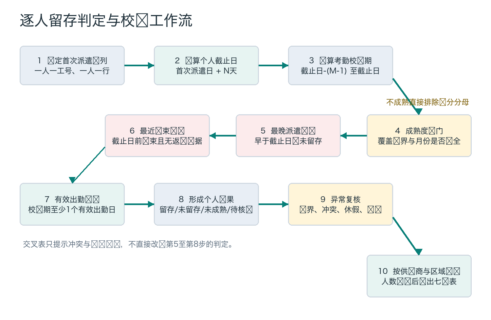
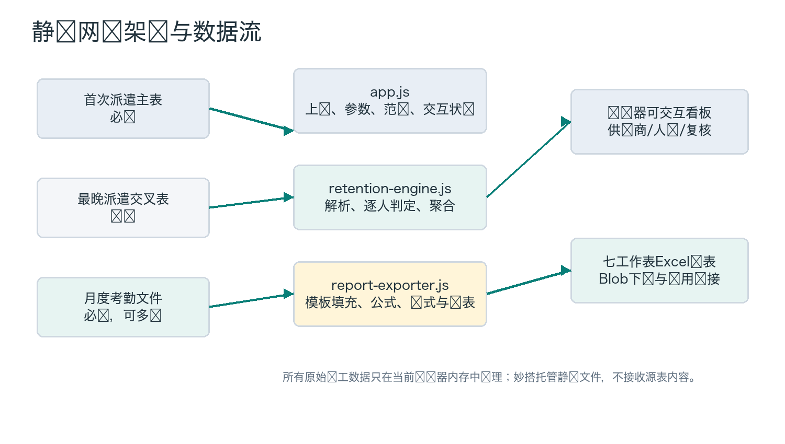

**OTWS / SUPPLIER PORTAL**

# 全球劳务工留存率 计算与校验工具

> 技术方案与交接手册  |  欧洲、美洲、亚太全球适配版

- **版本：**V20260806

- **文档日期：**2026年8月6日

- **应用地址：**https://ztn.feishuapp.com/app/app\_17agg2v5asy/

- **应用ID：**app\_17agg2v5asy

- **适用对象：**接手开发的AI工作台、工程同事、HR数据负责人和盘点项目负责人

- **文档定位：**现行统计口径、代码实现、数据合同、报表合同、测试与部署的单一交接入口

> **交接声明  **本文件按2026年8月6日工作区现状编制。若历史讨论、旧AI回复、旧使用说明或旧盘点技术底稿与本文件冲突，应先以现行代码和自动化测试为准，再由业务负责人确认是否修改规则。

> **当前验证状态  **《考勤记录（美洲亚太6月）.xlsx》已补齐。2026年8月6日已重跑美洲亚太真实数据引擎、三份七表Excel导出及线上妙搭端到端测试，全部通过，网页导出与参考报表物质差异0。

## 文档导航

- 0. 交接结论与事实优先级

- 1. 项目背景、需求演进与错误口径裁决

- 2. 产品范围、非目标与下游使用边界

- 3. 最终统计口径与逐人判定算法

- 4. OTWS日期字段语义与证据优先级

- 5. 数据源、字段合同与全球区域映射

- 6. 用户工作流与手工复算方法

- 7. 技术架构、代码结构与浏览器安全

- 8. 页面功能与交互状态

- 9. Excel报表合同

- 10. 飞书妙搭部署与发布运维

- 11. 测试证据、验收基线与当前状态

- 12. 已修复故障与回归保护

- 13. 已知限制、风险与待决策事项

- 14. 接手运行手册与变更控制

- 附录A. 口径状态台账

- 附录B. 字段与状态字典

- 附录C. 常用验证与发布命令

- 附录D. 项目文件与证据索引

> **建议阅读顺序  **业务接手先读第0、3、4、5、11、13节；开发接手再读第7、9、10、12、14节。

## 0. 交接结论与事实优先级

> **一句话结论  **这套工具锁定同一批首次派遣人员，给每个人相同的N天观察时长，再用OTWS最晚派遣、最近结束和截止日前M天有效考勤逐人判断，最后按首次派遣供应商汇总毛留存率。

- 统计对象必须是同一入职队列，不能用两个日期的全场出勤人数差代替留存。

- 观察期截止日按个人计算：首次派遣日+N个自然日；N可选7、14、30、60、90、180、365或自定义。

- 考勤校验期包含截止日，共M个自然日：截止日-(M-1)至截止日；M可选1、7、14、30或自定义。

- 有效出勤必须同时满足时长总计>0，且确认状态为已确认或已复核；同工号同日期只计1天。

- 主表决定统计队列和主要L/E字段；1-6月最晚派遣交叉表只发现冲突及粗暴剔除误伤，不直接决定留存。

- 输出是毛留存率。批准休假、我方减量、雇主转换等责任原因没有可靠结构化字段，不会被自动豁免。

- 工具是纯静态网页，文件只在浏览器本地解析；报表由浏览器内存生成并以Blob下载。

- 纯欧洲范围导出欧洲参考版七表；美洲、亚太或混合范围导出全球适配七表，区域字段和图表会自动切换。

### 0.1 单一事实来源的优先级

| 优先级 | 事实来源 | 使用原则 |
| --- | --- | --- |
| 1 | 现行源代码与自动化测试 | 决定程序今天实际做什么；任何口径说明都必须能回到代码和测试。 |
| 2 | 本技术方案与交接手册 | 解释现行实现、边界和风险；若与代码冲突，先标记差异，不静默改写事实。 |
| 3 | 现行Excel报表及区域使用说明 | 约束报表字段、排版、操作口径和宣导用语。 |
| 4 | 业务原始文件与OTWS讨论记录 | 用于解释为何采用当前设计，以及L/E字段的系统行为。 |
| 5 | 历史AI回复、旧技术底稿与讨论草案 | 只作背景，不可直接当成生产规则。 |

> **冲突处理  **不要由接手人自行选择最顺眼的一版。先列出代码行为、文档表述和业务意图三者差异，再由业务负责人明确是否变更。

### 0.2 当前交付状态

| 项目 | 当前状态 | 证据/备注 |
| --- | --- | --- |
| 欧洲90天/14日规则 | 可从现有源文件重跑 | 2026-08-06引擎测试与参考格式导出测试均通过。 |
| 美洲亚太90天/14日规则 | 可从现有源文件全量重跑 | 2026-08-06真实数据引擎、三份报表和线上端到端测试均通过。 |
| 本地全球网页 | 源代码与dist一致 | index、app、engine、exporter四个关键文件逐字节一致。 |
| 妙搭线上应用 | 2026-08-06端到端验证可用 | 公共URL可直接打开并使用4,249人真实数据完成计算、三大区切换和报表下载；发布元数据仍须发布前刷新。 |
| Excel输出合同 | 欧洲参考版0差异；全球版回归已建立 | 计数/百分比、动态区域行、核心结论、图表缓存均有自动化断言。 |

## 1. 项目背景、需求演进与错误口径裁决

本项目起于2026年度海外劳务供应商盘点。2025年盘点以仓长与HR主观评分为主，2026年希望利用OTWS/供应商门户中的首次派遣、最晚派遣、结束派遣和考勤留痕，把留存率变成可审计的客观指标。最终工具服务于供应商盘点，但它本身只负责计算和证据输出，不负责决定供应商等级。

### 1.1 需求演进时间线

| 阶段 | 核心问题 | 形成的决定 |
| --- | --- | --- |
| 口径争议 | 同事提出(y-x)/z：两天全场出勤人数差除以期间入职人数。 | 判定为净增/新增比，不是留存率；正式弃用。 |
| 同批原则 | 如何让1至3月不同日期入职的人接受同样考验。 | 每人以首次派遣日为锚点，分别计算个人截止日。 |
| 系统状态失真 | 工人现实已不来，但区域忘记结束派遣。 | 加入截止日前有效考勤作为现实层校验。 |
| L/E字段冲突 | 最晚派遣日期与最近结束日期存在等于、小于和大于三种关系。 | L用于主要覆盖判断，E作提前结束辅助判断；冲突保留到异常复核。 |
| 欧洲实算 | 用Q1首次派遣、1-6月派遣和月度考勤计算90天留存。 | 形成逐人证据、供应商汇总和七表报表。 |
| 参数化网页 | 不能只计算90天/14日。 | 观察周期和考勤校验期独立预设并支持任意正整数。 |
| 报表等价 | 网页导出必须与欧洲参考报表一致。 | 采用固定模板、缓存公式值、结构与样式差异测试。 |
| 妙搭部署 | 外部区域同事可通过链接使用并下载。 | 静态托管、免登录范围、Blob下载和备用下载链接。 |
| 全球扩展 | 适配美洲与亚太的大区、国家、运营区域层级。 | 区域映射、范围选择、全球版七表和运营区域图表。 |
| 全球报表修复 | 曾出现人数列百分比、留存率原始小数、区域行越界、核心结论重复和图表拥挤。 | 修复格式、动态布局和OpenXML图表缓存，并写回归测试。 |

### 1.2 为什么(y-x)/z不是留存率

```
同事公式：留存率 = (7月1日出勤人数y - 3月31日出勤人数x) / 4至6月入职人数z
```

y-x只表示全场在场人数净变化。它同时混入老员工离职、老员工请假、长假返岗、新人休班和新人留存，无法识别同一批新人。即使把人数相减改成名单相减，也会把3月31日缺勤、7月1日返岗的老人误判为新人，并漏掉7月1日恰好休班的新人。

它还有右删失偏差：6月30日入职、7月2日离职的人几乎没有经过观察，却会被当成留存；供应商可以通过统计窗口末尾集中入职抬高指标。

> **正式裁决  **该方法可以作为整体用工规模的净增指标，但不得命名为供应商留存率，也不得进入供应商盘点评分。

### 1.3 当前方法的本质

当前方法是入职队列留存：先固定目标期间内首次派遣的唯一工号，再给每个人相同的N天暴露时长。它回答的是“这个供应商新供的人，在经过相同时间后还剩多少”，而不是“整个仓库人数净增多少”。

> *业务证据：《FBU劳务工供应商管理考核指标及豁免规则》明确要求期内淘汰人数来自同一批；《捷克留存率统计》中的系统讨论也明确“看的是同一批人”。*

## 2. 产品范围、非目标与下游使用边界

### 2.1 产品范围

- 读取OTWS导出的首次派遣主表、可选最晚派遣交叉表及多个月度考勤文件。

- 支持欧洲、美洲、亚太及其混合范围，按大区、国家、运营区域、供应商和个人展示。

- 支持7、14、30、60、90、180、365天及自定义观察周期。

- 支持仅截止日、近7日、近14日、近30日及自定义考勤校验期。

- 识别未成熟、待核验、异常复核和人工调整，输出可追溯逐人证据。

- 导出固定七张工作表的Excel留存率报表。

- 通过飞书妙搭静态托管向外部用户提供相同工作流。

> **两种交付形态  **本地版和飞书妙搭版不是两套独立代码。它们共用同一统计引擎、页面和报表导出器：《留存率看板工具/》根目录是生产源与本地版，其中的dist-miaoda/是同步后供妙搭发布的静态包。开发只修改根目录，验证后再同步到dist-miaoda/。

### 2.2 明确非目标

- 不直接连接OTWS接口，也不自动登录或抓取线上员工数据。

- 不在服务器保存员工姓名、工号、考勤或报表；没有后端数据库。

- 不自动识别批准休假、我方减量、自然到期、雇主转换等责任归因。

- 不替代OTWS主数据治理；错误工号、错误区域和错误供应商仍需源头修正。

- 不直接计算2026供应商盘点最终等级；它只提供留存原始率、成熟分母、留存人数和证据。

- 不把月度留存率简单平均成半年度/年度指标；长期汇总必须重新合并分子分母。

### 2.3 与2026供应商盘点的关系

最新版《2026年度海外劳务供应商盘点：通俗说明与飞书Base操作SOP》将留存率设为10%客观维度。留存工具有原始值时应把原始率、成熟分母和留存人数写入客观数据表；无可靠原始值时才走仓长70%+HR30%的问卷替代流程。

> **规则隔离  **历史技术底稿曾建议用Wilson置信下限参与正式排名，但该底稿已于2026-07-29标注为被新版机制替代。工具仍输出95%CI用于风险观察，不应由本工具擅自决定最新盘点评分规则。

## 3. 最终统计口径与逐人判定算法

### 3.1 符号与自然日边界

| 符号 | 定义 | 现行实现 |
| --- | --- | --- |
| F | 首次派遣日期 | 队列锚点；供应商归属也取F时主表服务商。 |
| N | 留存观察周期天数 | 默认90；至少1；预设7/14/30/60/90/180/365，也可自定义。 |
| C | 个人观察期截止日 | C = F + N个自然日。F视为第0日。 |
| M | 考勤校验期天数 | 默认14；至少1；预设1/7/14/30，也可自定义。 |
| W | 个人考勤校验期 | W = [C-(M-1), C]，首尾均包含。 |
| L | 最晚派遣日期 | 主要判断系统派遣是否覆盖个人截止日。 |
| E | 最近一次派遣结束日期 | 辅助判断截止日前结束且未有结束后返岗证据。 |

```
个人截止日 C = 首次派遣日 F + N
考勤校验期 W = C-(M-1) 至 C（含首尾）
例：F=2026-03-31，N=90，则C=2026-06-29；M=14，则W=2026-06-16至2026-06-29
```

> **固定天数而非自然月  **页面上的一个月、两个月、三个月、半年、一年分别按30、60、90、180、365个自然日计算，不按月末滚动。

### 3.2 有效出勤定义

- 时长总计必须大于0。

- 确认状态必须精确等于已确认或已复核。

- 考勤类型不作为排除条件，派遣考勤、串岗考勤及其他类型只要满足前两条都可作为证据。

- 同一工号同一日期有多行时，只计为1个有效出勤日；同日任一行有效，该日即有效。

- 正工时但未确认的记录不算有效出勤，会进入人工复核提示。

- 0工时记录不算有效出勤，即使确认状态已完成。

### 3.3 数据成熟度闸门

程序只在该人员的整个校验期被已上传考勤源覆盖后，才允许判定留存或未留存。现行实现要求：校验期起点不早于全部考勤的最早日期；截止日不晚于全部考勤的最晚日期；校验期跨越的每个自然月都至少有一个已上传考勤文件中的日期。

> **实现边界  **程序会统计校验期内全局缺失的自然日并标为数据质量风险，但不会仅因某一天在全部文件中没有任何记录就自动判未成熟。原因是“当天确实无人出勤”和“当天文件漏传”在现有数据里无法自动区分。区域仍需确认上传的是完整月度导出，而不是月内截断文件。

### 3.4 逐人判定顺序

| 顺序 | 条件 | 模型结果 | 说明 |
| --- | --- | --- | --- |
| 1 | 校验期未被数据完整覆盖 | 未成熟 | 右删失处理，排除计分分母。 |
| 2 | L为空 | 待核验 | 关键日期缺失，排除计分分母。 |
| 3 | L < C | 未留存 | 系统最晚派遣早于个人截止日。 |
| 4 | E < C，且C前最后有效出勤为空或不晚于E | 未留存 | 截止日前已结束，且没有结束后返岗证据。 |
| 5 | W内无任何有效出勤 | 未留存 | 即使系统派遣覆盖截止日，也暂按未留存并进入复核。 |
| 6 | 其余情况 | 留存 | 系统覆盖截止日，且校验期内有有效出勤。 |

> **边界日  **L=C视为覆盖截止日；E=C不属于“截止日前结束”。若L≥C且校验期有有效出勤，可判留存，但日期恰好等于截止日会进入人工复核。

### 3.5 人工调整与最终采用结果

模型判定生成后，用户可在网页人员明细或异常复核中把个人改判为留存、未留存、未成熟、待核验或豁免，并填写证据说明。最终采用结果优先取人工调整，否则取模型判定；所有聚合和导出都按最终采用结果重算。

> **重要限制  **人工调整只存在当前浏览器内存中，刷新页面、清空数据或重新读取文件后不会恢复。正式调整必须先导出报表，并保留证据说明。

### 3.6 汇总公式

```
计分分母 = 留存人数 + 未留存人数
毛留存率 = 留存人数 / 计分分母
队列人数 = 留存 + 未留存 + 未成熟 + 待核验 + 豁免
```

未成熟、待核验和豁免不进入计分分母。供应商、运营区域、国家和大区的长期或多月留存率都应由同一层级的留存人数合计除以成熟计分分母合计，禁止简单平均各月百分率。

工具同时计算95% Wilson置信区间，并把成熟分母<10标为“样本不足（<10）”。这用于提示不确定性，不自动替代业务评分规则。

## 4. OTWS日期字段语义与证据优先级

### 4.1 最晚派遣L与最近结束E的关系

| 关系 | 已确认的系统含义 | 现行处理 |
| --- | --- | --- |
| L = E | 正常结束派遣，之后没有重新派遣。 | 按L与个人截止日比较；E作辅助。 |
| L < E | 包含最近结束日的派遣后来被删除；E冻结，L动态回退。 | 标记派遣删除异常；若截止日落在冲突区间，人工复核。 |
| L > E | 结束派遣后又重新派遣。 | 不能因历史E直接剔除；必须继续检查L与截止日前有效出勤。 |
| 任一为空 | 字段不完整或不存在相关记录。 | L为空即待核验；E为空不单独否定留存。 |

> *证据来源：《最晚派遣与最近结束时间的关系.docx》和《留存率统计讨论.docx》，2026年7月9日至10日系统讨论。*

### 4.2 主表、交叉表和考勤的责任分工

| 证据 | 决定什么 | 不决定什么 |
| --- | --- | --- |
| 首次派遣主表 | 队列、首次派遣、入职供应商、区域及主要L/E。 | 不能证明现实中仍在出勤。 |
| 最晚派遣交叉表 | 两次导出L/E是否一致、人员是否出现在1-6月筛选、粗暴剔除误伤候选。 | 不能整表剔除，不能覆盖主表判定。 |
| 考勤记录 | 现实出勤证据、截止日前返岗证据、供应商/区域冲突提示。 | 不能单独证明已完成合法离职流程或责任归因。 |
| 人工业务证据 | 批准休假、未排班、我方减量、雇主转换、错误操作等。 | 没有凭证时不得口头豁免。 |

### 4.3 自动结束派遣的历史讨论

系统讨论记录提到自动停用可按区域配置，并按“连续7天不含当天”向前判断；若第8天恢复出勤，示例人员不会因此前7天缺勤被自动结束。该信息解释了为何单日出勤或静态E字段都不可靠，但它属于2026年7月的行为说明，不应假定所有区域、所有上线阶段配置完全一致。

> **实现原则  **当前工具不依赖自动结束配置是否正确，而是把L/E与实际有效出勤并列为证据。任何系统配置变化都应通过合成测试和真实边界病例重新验证。

## 5. 数据源、字段合同与全球区域映射

### 5.1 文件角色

| 文件角色 | 必需性 | 用途 | Q1 90天/14日建议范围 |
| --- | --- | --- | --- |
| 首次派遣队列 | 必传 | 确定目标人员、F、L/E、供应商和区域。 | 首次派遣为1月1日至3月31日。 |
| 最晚派遣交叉表 | 选传 | 比对L/E与识别粗暴剔除误伤。 | 可使用1至6月筛选导出。 |
| 考勤记录 | 必传，可多选 | 构造有效出勤证据和数据成熟度。 | 正式校验窗口覆盖3月19日至6月29日；1至2月只用于首次到岗错位审查。 |

> **关于1月考勤  **计算Q1人员90天留存率且使用14日窗口时，1月和2月考勤通常不进入正式留存窗口；上传它们的价值主要是核验首次派遣与首次有效出勤是否错位。真正不可缺的是覆盖所有个人窗口的3月下旬至6月数据。

### 5.2 用工管理文件字段合同

| 字段 | 当前要求 | 用途/风险 |
| --- | --- | --- |
| 工号 | 必需、非空 | 唯一连接键；重复时当前实现保留文件中最后一条并记录质量风险。 |
| 首次派遣日期 | 必需 | 队列筛选与个人截止日。 |
| 最晚派遣日期 | 必需 | 系统覆盖截止日的主要判断。 |
| 服务商名称 | 必需 | 供应商归组与名称标准化。 |
| 区域 | 必需 | 大区、国家和运营区域映射。 |
| 最近一次派遣结束日期 | 强烈建议 | 提前结束与返岗辅助判断；缺失不单独否定留存。 |
| 姓名/服务商编码 | 建议 | 报表展示、追溯和供应商身份核验。 |
| 状态/派遣状态/结束类型/原因/具体原因 | 可选 | 只保留为证据，不进入自动责任豁免。 |

解析器会在工作簿前5行内寻找同时包含必需字段的工作表。列名采用精确匹配；目前没有宽松别名表。新增或改名字段前应先修改解析器和测试，不可只改页面说明。

### 5.3 考勤文件字段合同

| 字段 | 必需性 | 处理规则 |
| --- | --- | --- |
| 工号 | 必需 | 与队列工号精确连接。 |
| 考勤日期 | 必需 | 支持Excel日期、日期对象及YYYY-MM-DD等常见文本。 |
| 时长总计 | 必需 | 数值化后>0才可能有效。 |
| 确认状态 | 必需 | 仅已确认、已复核为最终状态。 |
| 考勤类型 | 必需 | 记录到证据，不作为排除条件。 |
| 供应商名称/供应商ID/区域 | 可选 | 用于窗口供应商与区域冲突提示。 |

### 5.4 全球区域映射

| 大区 | 运营区域到国家映射 |
| --- | --- |
| 欧洲 | 英国区→英国；德国区→德国；法国区→法国；捷克区→捷克；波兰区→波兰；意大利区→意大利；西班牙区→西班牙。 |
| 美洲 | 加州区、新泽西区、亚特兰大区、芝加哥区、休斯顿区、达拉斯区、萨凡纳区、迈阿密区、西雅图区、诺福克区→美国；加拿大区→加拿大。 |
| 亚太 | 澳洲区→澳大利亚；韩国区→韩国；日本区→日本。 |
| 未识别 | 区域值不在映射表时，大区=未识别，国家保留原区域文本；不会静默归到其他大区。 |

> **新增区域  **新增区域必须同时更新retention-engine.js中的REGION\_METADATA、真实/合成测试和报表验收。只在页面增加选项不会改变数据映射。

### 5.5 供应商名称标准化

主表与考勤可能使用不同编码体系，因此供应商一致性主要按名称标准化：Unicode规范化、去音标、转小写、非字母数字汉字转空格、压缩空白，再应用少量人工别名。当前别名包括Niden、Dreman、Atlaswork、GI Group、AMA Service、Attal Group和Zenith等已知写法。

> **风险  **别名表是代码内硬编码，未覆盖的新法定名称、简称、拼写错误或集团主体变化会造成供应商差异提示。编码不能跨PS/S体系直接等同，新增别名必须有业务证据。

### 5.6 实际数据目录与当前状态

| 范围 | 源目录 | 当前情况 |
| --- | --- | --- |
| 欧洲 | 留存率统计/欧洲/ | Q1主表、1-6月交叉表、1-6月考勤齐全；今天可重跑。 |
| 美洲亚太 | 留存率统计/美洲亚太/ | Q1主表、1-6月交叉表与1-6月合并考勤齐全；2026-08-06已全量重跑。 |
| 亚太补充 | 留存率统计/亚太/ | 有1-5月单独亚太考勤，但不是8月4日全球回归使用的合并文件包。 |
| 参考报表 | outputs/reference_retention_reports/ | 欧洲Q1参考版，用于0差异回归。 |
| 全球成品 | outputs/retention_global_2026Q1/ | 美洲亚太、美洲、亚太三份成品已于2026-08-06重新生成并通过回归。 |

## 6. 用户工作流与手工复算方法

### 6.1 标准操作工作流

1. 确定统计队列日期，例如2026-01-01至2026-03-31。

1. 先选择观察周期N和考勤校验期M，确认页面提示的最早/最晚考勤覆盖日期。

1. 上传首次派遣队列；按需上传最晚派遣交叉表；多选覆盖范围内全部月度考勤。

1. 点击读取并校验数据，检查唯一工号、日期范围、识别大区、重复工号和考勤覆盖。

1. 选择全部已上传大区或单独欧洲/美洲/亚太，再点击应用口径并计算。

1. 查看看板、供应商、人员明细和异常复核，处理可能改变结果或归责的病例。

1. 对有证据的病例做人工调整并填写说明，确认人数闭环。

1. 导出报表；若浏览器未自动下载，点击顶部“下载已生成报表”。



图1  逐人留存判定与校验工作流

### 6.2 没有工具时的Excel手工复算

1. 在主表按首次派遣日期筛选目标期间，按工号去重并保留F、L、E、供应商和区域。

1. 新增个人截止日列：F+N；新增窗口起点列：个人截止日-(M-1)。

1. 把考勤按工号+日期去重，建立有效出勤标记：时长>0且确认状态为已确认/已复核。

1. 对每个工号统计窗口内有效出勤天数，并取截止日前最后有效出勤日。

1. 先判断窗口是否被考勤源覆盖；不完整则未成熟。

1. 依次应用L<C、E<C且无结束后出勤、窗口无有效出勤三条未留存规则。

1. 把每个人归回首次派遣供应商，按留存人数/成熟计分分母汇总。

1. 做人数闭环：个人=供应商=运营区域=国家=大区=总计。

> **禁止捷径  **不要用两天总人数相减，不要把出现在1-6月最晚派遣交叉表的人全部剔除，也不要把未成熟人员当未留存。

## 7. 技术架构、代码结构与浏览器安全

### 7.1 总体架构

应用没有构建服务器、后端接口或数据库，是由HTML、CSS、JavaScript和本地Excel依赖组成的静态站点。主线程在浏览器读取文件并计算；结果只保存在页面内存；导出时把嵌入式Excel模板填充为Blob并触发下载。



图2  静态网页架构与数据流

### 7.2 代码模块

| 文件 | 职责 | 维护注意 |
| --- | --- | --- |
| index.html | 页面结构、上传控件、参数预设、看板/明细/复核/流程五个视图。 | 用户可见措辞使用“观察期截止日”，不显示孤立T。 |
| app.css | 响应式布局、表格、状态、流程图和移动端样式。 | 修改后需桌面和移动端截图验收。 |
| app.js | 文件读取、参数状态、范围筛选、看板渲染、人工调整和导出入口。 | 调整参数后会清除旧下载Blob，避免导出陈旧结果。 |
| retention-engine.js | 字段解析、日期处理、考勤证据、逐人判定、Wilson区间和聚合。 | 统计规则的最高事实来源。 |
| report-exporter.js | 模板填充、公式、样式、表结构、图表OpenXML和下载。 | 任何列变化都必须同步公式列号、表XML和测试。 |
| vendor/retention-report-template.xlsx | 欧洲参考版Excel视觉模板。 | 模板变更后需重新生成JS嵌入文件。 |
| vendor/retention-report-template.js | 模板Base64，供纯浏览器导出。 | 必须与xlsx模板同步。 |
| vendor/xlsx.full.min.js | 解析上传的Excel/CSV。 | 本地静态依赖，避免外部CDN。 |
| vendor/xlsx-populate-no-encryption.min.js | 修改模板、公式与OpenXML。 | 负责最终xlsx生成。 |

### 7.3 本地版、妙搭版与目录关系

```
工具根目录（生产源+本地版）：留存率统计/留存率看板工具/
妙搭发布包：留存率统计/留存率看板工具/dist-miaoda/
公开地址：https://ztn.feishuapp.com/app/app_17agg2v5asy/
```

本地版直接打开根目录index.html即可使用，所有Excel都在当前浏览器中解析。妙搭版是根目录静态资源的发布副本，对外提供相同工作流，不另设后端数据库。开发只修改根目录；发布前把index.html、app.css、app.js、retention-engine.js、report-exporter.js及vendor同步到dist-miaoda，再逐文件比较。2026-08-06检查显示四个核心页面/脚本文件与部署目录一致。

> **交接包规则  **交接包必须同时保留工具根目录与其dist-miaoda子目录，并保留scripts验证脚本。不得把两种形态拆成两个独立代码仓，也不得把真实员工源数据或真实导出报表装入可外发交接包。

### 7.4 本地数据安全与下载机制

- 浏览器通过File.arrayBuffer读取用户选择的文件，不主动上传到妙搭或其他服务器。

- 静态资源全部随应用发布，本地Excel解析不依赖第三方CDN。

- 导出器以URL.createObjectURL创建Blob链接，先尝试自动点击下载。

- 妙搭或浏览器拦截自动下载时，页面保留“下载已生成报表”链接供用户手动点击。

- 重新计算、切换范围、重新导出或离开页面时会撤销旧Blob URL，避免下载旧报表和内存泄漏。

- 线上验收使用合成数据；真实员工PII不应上传到测试日志或公共仓库。

## 8. 页面功能与交互状态

### 8.1 上传区

页面标题为“上传OTWS导出文件”。首次派遣队列和考勤记录为必需，最晚派遣交叉表为可选；考勤支持多选和拖拽。读取时显示逐文件进度，大型月度考勤可能需要数十秒。

### 8.2 参数区

| 控制 | 预设 | 实际作用 |
| --- | --- | --- |
| 统计范围 | 全部已上传大区、欧洲、美洲、亚太、未识别 | 只过滤结果，不改变逐人判定。 |
| 首次派遣队列日期 | 读取后自动填主表最小/最大F，可手改 | 决定纳入哪些工号。 |
| 留存观察周期 | 7/14/30/60/90/180/365/自定义 | 改变每个人的截止日。 |
| 考勤校验期 | 1/7/14/30/自定义 | 改变截止日前向前检查的有效出勤范围。 |

> **参数验证缺口  **HTML输入框声明观察周期最大3650天、考勤窗口最大365天，但引擎只强制至少1天，没有在JavaScript中硬性拦截超出HTML max的值。正常操作应遵守页面范围；未来应补充显式上限校验和测试。

### 8.3 结果视图

| 视图 | 内容 | 主要动作 |
| --- | --- | --- |
| 看板 | 队列、分母、留存、未留存、留存率、未成熟、复核；运营区域和原因分布。 | 检查整体成熟度和风险。 |
| 供应商 | 按国家筛选、名称搜索、样本筛选、列排序、95%CI。 | 比较供应商，识别小样本。 |
| 人员明细 | 逐人工号、F/C/W、L/E、有效出勤、模型判定和人工调整。 | 追溯任一汇总数字。 |
| 异常复核 | 边界、L/E冲突、未确认正工时、系统覆盖但无出勤、供应商转换等。 | 录入证据与改判。 |
| 工作流程 | 手工统计步骤和必须完成的校验。 | 区域宣导和人工复算。 |

网页界面刻意不展示孤立的T，而使用“观察期截止日”“仅截止日”“含截止日近14日”等业务语言。导出的Excel为保持与参考模板完全一致，仍保留F、T、L、E技术缩写。

## 9. Excel报表合同

### 9.1 文件名和分支规则

```
标准季度：{统计范围}劳务工供应商{N}天留存率报表_{YYYY}Q{季度}.xlsx
非完整季度：{统计范围}劳务工供应商{N}天留存率报表_{开始日}-{结束日}.xlsx
```

只有统计范围为纯欧洲且所有结果都属于欧洲时使用欧洲参考版“国家汇总”；美洲、亚太、全球、美洲亚太或含非欧洲结果时使用全球版“区域汇总”。

### 9.2 七张工作表

| 顺序 | 工作表 | 主要内容 |
| --- | --- | --- |
| 1 | 统计总览 | 标题、口径、核心KPI、国家/运营区域表、柱状图和单一核心结论。 |
| 2 | 国家汇总/区域汇总 | 欧洲按国家；全球版按大区+国家+运营区域。 |
| 3 | 供应商留存率 | 供应商总计、分月分母/留存/留存率、95%CI、异常数和样本标记。 |
| 4 | 人员明细 | 一人一行的全部派遣、考勤、判定、人工调整和公式一致性证据。 |
| 5 | 异常复核 | 只保留需人工复核人员和建议核验动作。 |
| 6 | 数据质量与审查 | 源文件概况、重复工号、覆盖、人数平衡、字段冲突和公式校验。 |
| 7 | 口径说明 | 正式定义、数据源角色、边界、判定顺序和限制。 |

### 9.3 核心字段合同

欧洲汇总的前列为国家、区域；全球汇总的前列为大区、国家、运营区域。供应商表在此基础上增加供应商名称和编码。人员明细全球版共有43列，欧洲版42列，唯一差异是全球版多一个大区列。

| 字段组 | 关键字段 |
| --- | --- |
| 身份与归属 | 大区、国家、运营区域、入职供应商、编码、姓名、工号。 |
| 日期证据 | 首次派遣F、观察日T、窗口起点、最晚派遣L、最近结束E、T前最后有效出勤。 |
| 考勤证据 | 窗口有效出勤天数/日期、考勤记录天数、未确认正工时、考勤类型、首次有效出勤及滞后。 |
| 交叉与质量 | 匹配1-6月表、粗暴剔除误伤候选、L/E关系、复核原因、质量标记、窗口供应商/区域差异。 |
| 结果与调整 | 模型判定、判定主因、人工调整结果/说明、最终采用结果、核对结果、公式一致性。 |

### 9.4 格式和公式红线

- 所有人数、天数和供应商数必须是整数格式，不得套百分比。

- 留存率和95%CI必须以百分比格式存储，底层值保持0至1数值。

- 统计总览的动态运营区域数据行不得落入合并单元格；核心结论只出现一次并随区域数下移。

- 全球版柱状图横轴只显示运营区域，不附国家前缀；完整信息保留在区域汇总。

- 图表分类缓存和数值缓存必须分别更新，分组枚举必须为clustered，禁止非法grouping=none。

- 公式同时写入缓存值，保证WPS和不立即重算的客户端打开时也能看到正确结果。

- 人数闭环和公式一致性必须在“数据质量与审查”页显示通过。

> **兼容性说明  **人员明细中的“Python核对结果”是早期欧洲分析脚本留下的列名；生产网页实际由JavaScript引擎判定。该名称不影响计算，但属于应在下一次获批模板升级时统一的文字技术债。

当所有人员均成熟且无待核验时，报表会写入完整Excel判定公式用于独立复算；若存在未成熟或待核验，模型结果以JavaScript计算值写入，人工调整和汇总公式仍可工作。

## 10. 飞书妙搭部署与发布运维

### 10.1 应用信息

**公开地址：**[https://ztn.feishuapp.com/app/app\_17agg2v5asy/](https://ztn.feishuapp.com/app/app_17agg2v5asy/)

应用ID：app\_17agg2v5asy

最后已记录发布：release\_id 7670149284696608030，2026-08-04状态finished。最后已记录访问配置：scope=All，require\_login=false。

> **状态时点  **上述发布和访问范围是2026-08-04的最后验证记录。2026-08-06尝试通过飞书OpenAPI刷新时，当前执行环境未能完成联网调用，因此交接人发布前必须重新查询，不得把8月4日状态当作永久事实。

### 10.2 发布前置

- 确认lark-cli用户身份可用，并用--as user操作。

- 欧洲引擎、欧洲参考报表与美洲亚太全球真实数据测试必须全部通过。

- 运行本地浏览器真实/合成验收，确认页面、参数、范围切换和下载。

- 把源目录需要发布的静态文件同步到dist-miaoda并逐文件比较。

- 确认目录内没有.env、凭证、真实员工源表或测试下载报表。

### 10.3 发布流程

```
lark-cli auth status --verify
lark-cli apps +html-publish --app-id app_17agg2v5asy --path '留存率统计/留存率看板工具/dist-miaoda' --as user
lark-cli apps +release-list --app-id app_17agg2v5asy --as user --page-size 5
lark-cli apps +access-scope-get --app-id app_17agg2v5asy --as user
```

html-publish对HTML应用会返回URL或发布号。若产生发布号，应持续查询到finished；失败时先查看发布详情，不要重复覆盖。访问范围如需外部免登录，应由有权限人员明确确认public/All和require\_login=false，不能在未授权情况下修改。

### 10.4 线上验收

- 公共URL直接打开，无登录重定向，标题和本地解析模块显示已就绪。

- 先用6人合成数据验证欧洲、美洲、亚太三种范围和三份报表，避免真实PII外泄。

- 验证自定义观察周期与自定义考勤窗口确实改变结果。

- 拦截自动下载后，备用Blob链接仍能下载。

- 检查七张工作表、计数/百分比格式、动态区域行、核心结论和图表横轴。

- 最后再在授权环境使用一组真实数据做只读比对，并删除测试产物。

## 11. 测试证据、验收基线与当前状态

### 11.1 自动化测试矩阵

| 测试 | 覆盖范围 | 2026-08-06状态 |
| --- | --- | --- |
| retention-engine.real-data.test.js | 欧洲真实数据；90/14、仅截止日、缺月、365天右删失、人数平衡。 | 通过。 |
| report-exporter.real-data.test.js | 欧洲七表与参考报表的工作表、范围、公式、字段、值和格式。 | 通过，物质差异0。 |
| global-retention.real-data.test.js | 美洲亚太真实数据、范围拆分、全球字段、格式、动态布局和图表OpenXML。 | 通过；三份报表已重新生成。 |
| verify_global_retention_app.js | 公共妙搭页面上传真实美洲亚太数据、三大区切换、页面与导出差异。 | 2026-08-06通过；导出与参考报表物质差异0。 |
| verify_global_retention_app_synthetic.js | 线上公共页面，6人合成数据，三大区切换和三份报表。 | 8月4日最后通过。 |
| verify_miaoda_retention_app.js | 线上欧洲真实数据、自定义45/10、Blob备用下载、欧洲参考版0差异。 | 7月21日最后通过。 |

### 11.2 回归基线

| 范围 | 队列/分母 | 留存 | 未留存 | 毛留存率 | 需复核 | 粗暴误伤 |
| --- | --- | --- | --- | --- | --- | --- |
| 欧洲 | 4,955 / 4,955 | 1,286 | 3,669 | 25.9536% | 399 | 293 |
| 美洲亚太 | 4,249 / 4,249 | 911 | 3,338 | 21.4403% | 477 | 193 |
| 美洲 | 4,099 / 4,099 | 861 | 3,238 | 21.0051% | 见明细 | 见明细 |
| 亚太 | 150 / 150 | 50 | 100 | 33.3333% | 见明细 | 见明细 |

> *欧洲与美洲亚太基线均于2026-08-06从现有源文件重新通过；全球报表与线上端到端验收同日通过。*

### 11.3 欧洲动态边界验证

| 场景 | 预期 | 实测 |
| --- | --- | --- |
| 90天+14日 | Q1全部成熟 | 留存1,286，未留存3,669。 |
| 90天+仅截止日 | 证据更窄，留存不得高于14日窗口 | 留存699，小于1,286。 |
| 删除5月覆盖 | 相关人员应未成熟 | 未成熟2,756。 |
| 365天+14日，仅有至6月考勤 | 全部右删失，不进入分母 | 未成熟4,955，分母0。 |

### 11.4 验收红线

- 队列人数必须等于五种最终状态之和。

- 供应商、运营区域、国家、大区和总计的队列人数必须闭合。

- 任何新周期或窗口都必须重算个人截止日和窗口，不能只改报表标题。

- 未成熟不得进入分母，缺L不得默认为未留存。

- 计数列不得为百分比，百分比列不得显示原始小数。

- 纯欧洲导出必须与参考版字段、顺序、公式、格式和排版一致。

- 全球图表横轴只显示运营区域，核心结论不得重复。

- 线上备用下载链接必须在自动下载被拦截时可用。

## 12. 已修复故障与回归保护

| 历史故障 | 根因 | 修复与保护 |
| --- | --- | --- |
| 未留存人数显示百分比 | 动态区域行复制了错误样式。 | 计数列逐列断言不得含%；真实全球测试覆盖。 |
| 90天留存率显示原始小数 | 留存率列未套用百分比样式。 | 总览、区域、供应商及图表辅助列逐格断言百分比格式。 |
| 留存率列超出区域表格 | 动态行与模板固定合并区冲突。 | 先解除旧合并；核心结论按区域数动态下移；数据行不得落入合并区域。 |
| 核心结论重复多列 | 在未解除合并状态下批量填充。 | 标题和正文各保留单一合并区域，只在左上角写值。 |
| 图表横轴过度拥挤 | 使用国家+运营区域复合标签。 | 全球版横轴只取运营区域；完整上下文留在表格和提示。 |
| 图表缓存错位 | 系列缓存、分类缓存和数值缓存被统一替换。 | 分别精准定位三个OpenXML节点并断言点数和内容。 |
| WPS图表OpenXML告警 | 模板存在非标准grouping=none。 | 导出时统一改为clustered并在测试中禁止none。 |
| 妙搭自动下载无反应 | 托管环境可能拦截脚本触发下载。 | Blob自动下载+持久备用下载链接；回归测试主动拦截自动点击。 |

> **变更原则  **这些故障都来自报表合同而非统计公式。以后即使只改样式，也必须跑真实多区域报表测试；不能以“数字看起来对”替代结构和格式验收。

## 13. 已知限制、风险与待决策事项

### 13.1 现行已知限制

| 风险 | 可能影响 | 当前控制 |
| --- | --- | --- |
| 毛留存无责任归因 | 批准休假、我方减量或雇主转换可能使供应商被低估。 | 默认未留存+人工复核；有证据才豁免。 |
| 系统漏结束 | L可能覆盖截止日但现实已离开。 | 强制检查截止日前有效出勤。 |
| 首次派遣不等于首次到岗 | 实际暴露时长与F错位。 | 保留首次有效出勤和滞后>7日质量标记，但不自动平移截止日。 |
| 整月存在不代表月内完整 | 局部漏导日期可能把人员误判未留存。 | 全局缺失日质量标记+区域确认完整导出。 |
| 重复工号保留最后一条 | 不同供应商/区域的重复记录可能被静默覆盖。 | 记录重复数量；正式使用前要求一人一行。 |
| 字段精确匹配 | OTWS列名变化会直接读取失败。 | 解析时明确报错；改字段需同步代码和测试。 |
| 区域映射硬编码 | 新增区域会落入未识别。 | 未识别显式展示；新增映射走变更流程。 |
| 供应商别名硬编码 | 简称/法定名变化会产生归属差异。 | 标准化+少量别名；新增别名需证据。 |
| 人工调整不持久化 | 刷新页面后丢失。 | 导出报表保存调整和说明。 |
| 自定义上限未硬校验 | 异常大周期可能造成全部未成熟或性能问题。 | HTML给出max；待补JavaScript显式校验。 |
| 真实数据含员工PII | 若复制进交接包或测试日志，可能造成个人信息泄露。 | 交接包只含工具、测试和文档；真实源表保留在受控工作区。 |
| 线上状态非实时确认 | 访问范围或版本可能已被他人改变。 | 引用8月4日最后验证；发布前重新查询。 |

### 13.2 必须由业务负责人决定的事项

- 责任留存：哪些离职原因可从分母剔除，审批人、证据和追溯方式是什么。

- 批准休假：多长休假仍视为留存，考勤窗口是否按区域排班差异调整。

- 首次到岗锚点：是否继续以首次派遣F为唯一锚点，或在明确NO SHOW/错派时改用首次有效出勤。

- 雇主转换：继续归责首次供应商，还是从原供应商分母豁免并在新供应商建立新队列。

- 边界日：结束日期等于截止日时，是否必须有当日出勤，还是窗口任一日即可。

- 小样本使用：分母<10仅警示、不排名，还是采用问卷替代；以最新版盘点SOP为准。

- 观察周期组合：90天是否作为盘点主指标，30天/180天是否只作运营监控。

> **治理边界  **以上决定会改变指标含义，不能作为“修bug”由开发者单方面上线。每项必须形成版本化口径、边界例子、测试样本和生效日期。

### 13.3 建议优先级

| 优先级 | 事项 | 完成标准 |
| --- | --- | --- |
| P0 | 交接包保持去PII与版本可追溯 | 包内无真实员工源表、凭证或下载报表；提供清单与SHA-256。 |
| P0 | 发布前刷新妙搭版本和访问范围 | release=finished，外部匿名访问实测通过。 |
| P1 | 把责任豁免规则结构化 | 离职原因、休假、我方原因有字段、审批和报表审计。 |
| P1 | 补自定义天数硬校验 | 超上限和非整数输入被明确阻止并有测试。 |
| P1 | 为部分月度导出建立完整性校验 | 源文件有明确导出起止、仓区覆盖和行数基线。 |
| P2 | 外置区域映射和供应商别名 | 业务可维护版本化配置，并有未知值告警。 |
| P2 | 人工调整导入/恢复 | 带证据的调整可安全续接，不依赖单次浏览器会话。 |

## 14. 接手运行手册与变更控制

### 14.1 接手后的前30分钟

1. 打开本文件，确认当前统计规则、测试基线和待决策事项；不要先改代码。

1. 检查留存率看板工具源目录、dist-miaoda目录和七个核心静态资源。

1. 运行欧洲引擎测试和欧洲参考报表测试，建立本机基线。

1. 运行美洲亚太全球真实数据测试，确认三份报表与当前基线一致。

1. 打开公开URL，用合成数据验证三大区范围和下载。

1. 查询妙搭最新发布号和访问范围，把结果记录到变更日志。

1. 选择一个真实人员，从F、C、W、L、E、有效出勤手工复算到最终结果。

### 14.2 常见变更路径

| 变更 | 必须改动 | 必须验证 |
| --- | --- | --- |
| 新增区域 | REGION_METADATA、必要的名称/国家排序。 | 合成数据映射、范围筛选、全球七表、图表标签。 |
| 新增字段别名 | findSheetWithHeaders或字段解析层。 | 旧列名仍可读，新列名可读，错误列名明确报错。 |
| 修改留存规则 | retention-engine.calculate、口径说明、页面流程、报表公式。 | 边界合成样本、欧洲基线差异说明、业务批准。 |
| 修改Excel模板 | template.xlsx、build-report-template、template.js、exporter列号。 | 欧洲0差异基线更新需明确批准；全球图表OpenXML回归。 |
| 修改页面文案 | index.html和可能的uiText。 | 桌面/移动端无溢出；不得影响报表模板的T兼容字段。 |
| 修改下载 | report-exporter.download、app Blob状态。 | 自动下载和备用链接两条路径。 |
| 发布妙搭 | dist-miaoda同步和html-publish。 | 发布状态、匿名访问、合成端到端和静态资源无错误。 |

### 14.3 变更控制清单

- \[ ] 业务口径是否改变，是否有负责人和生效日期。

- \[ ] 代码、页面、报表口径说明和使用说明是否同步。

- \[ ] 个人级边界样本是否覆盖等于、早于、晚于截止日。

- \[ ] 未成熟、待核验、豁免是否仍排除分母。

- \[ ] 欧洲参考版是否仍满足完全一致要求。

- \[ ] 全球版人数/百分比、动态行、核心结论和图表是否回归。

- \[ ] 源目录与dist-miaoda是否一致。

- \[ ] 线上发布号、访问范围和合成验收是否留证。

- \[ ] 测试中是否避免上传真实员工PII。

- \[ ] 变更后是否更新本技术方案的版本和状态台账。

### 14.4 故障排查顺序

1. 上传失败：先核对必需字段是否精确存在于工作表前5行，再检查文件格式和工号空白。

1. 全部未成熟：检查页面提示的所需考勤范围、最早/最晚日期和中间月份是否齐全。

1. 留存率异常低：分解未留存原因，重点看L<C和系统覆盖但无有效出勤；不要先改公式。

1. 供应商归属异常：检查入职主表供应商、考勤窗口供应商、编码体系和名称别名。

1. 网页有结果但导出失败：检查模板JS和XlsxPopulate是否就绪，再看Blob备用链接。

1. 报表数值对但格式错：检查样式来源列、动态区域行、数值格式和表XML，不改统计引擎。

1. 线上与本地不同：先比较dist与源文件哈希，再查发布号和浏览器缓存。

## 附录A. 口径状态台账

| 议题 | 状态 | 现行结论 |
| --- | --- | --- |
| 同一批人经过相同时间 | 已采用 | 按首次派遣区间锁定队列，每人F+N。 |
| (y-x)/z | 已废弃 | 是净增/新增比，不是留存率。 |
| 两张单日出勤名单相减 | 已废弃 | 受请假、返岗和休班污染。 |
| 出现于1-6月最晚派遣表即剔除 | 已废弃 | 交叉表只校验，不直接决定留存。 |
| L为主要系统日期 | 已采用 | L<C判未留存；冲突保留复核。 |
| E辅助判断提前结束 | 已采用 | E<C且无结束后有效出勤才判未留存。 |
| 截止日前有效出勤 | 已采用 | M日窗口至少1天有效出勤。 |
| 系统覆盖但无出勤 | 已采用 | 默认未留存并进入异常复核。 |
| 批准休假/我方原因自动豁免 | 待决策 | 现有数据无结构化字段，不自动处理。 |
| 观察周期可自定义 | 已采用 | 预设加任意正整数；上限硬校验待补。 |
| 考勤窗口可自定义 | 已采用 | 含截止日的M个自然日。 |
| 月度留存率简单平均 | 已废弃 | 长期指标使用合计留存/合计成熟分母。 |
| Wilson置信区间 | 保留展示 | 用于不确定性提示；不由工具决定正式评分。 |
| Wilson下限正式排名 | 历史规则 | 旧技术底稿已被7月29日最新版SOP替代。 |
| 纯欧洲完全复刻参考报表 | 已采用 | 字段、公式、格式、布局0物质差异。 |
| 全球版运营区域展示 | 已采用 | 表格保留大区/国家/运营区域，图表只显示运营区域。 |

## 附录B. 字段与状态字典

### B.1 最终状态

| 状态 | 是否进分母 | 含义 |
| --- | --- | --- |
| 留存 | 是 | 通过派遣日期、结束日期和窗口有效出勤检查。 |
| 未留存 | 是 | L早于截止日、提前结束无返岗，或窗口无有效出勤。 |
| 未成熟 | 否 | 截止日或校验期尚未被上传考勤覆盖。 |
| 待核验 | 否 | 缺少最晚派遣日期等关键证据。 |
| 豁免 | 否 | 人工举证确认的非计分情形。 |

### B.2 主要人工复核标记

| 标记 | 触发条件 | 建议动作 |
| --- | --- | --- |
| 截止日边界日期需确认 | L=C或E=C。 | 确认当日工作和公司边界口径。 |
| L<E且截止日落在冲突区间 | 派遣删除导致L回退、E冻结。 | 回溯删除/结束记录。 |
| L日之后仍有有效出勤 | 考勤晚于主表L。 | 核对L的导出时点和实际派遣。 |
| 交叉表L/E与主表不一致 | 两份用工导出不同。 | 确认导出时点，以可追溯最新数据重算。 |
| 系统派遣覆盖截止日但窗口无有效出勤 | L≥C且W内无有效出勤。 | 核实休假、未排班或漏结束；无证据维持未留存。 |
| 窗口存在未确认正工时 | 工时>0但状态不是已确认/已复核。 | 先完成确认再计算。 |
| 截止日校验期供应商与入职供应商不一致 | 窗口供应商名称标准化后不含入职供应商。 | 核实雇主转换及归责。 |
| 截止日校验期出现多个供应商 | 窗口有效出勤来自多个供应商。 | 核实转换或重复归属。 |

### B.3 报表汇总字段

| 字段 | 定义 |
| --- | --- |
| 原始队列人数 | 日期范围内有有效首次派遣日期的唯一工号数。 |
| 计分分母 | 最终采用结果为留存或未留存的人数。 |
| 留存人数 | 最终采用结果为留存。 |
| 未留存人数 | 最终采用结果为未留存。 |
| 留存率 | 留存人数/计分分母。 |
| 95%CI | 基于Wilson方法的二项比例置信区间。 |
| 需人工复核 | 存在至少一个可能改变结论或归责的人工标记。 |
| 匹配1-6月表 | 工号存在于可选交叉表。 |
| 粗暴剔除误伤候选 | 存在于交叉表，但主表L仍不早于个人截止日。 |
| 样本标记 | 成熟计分分母<10为样本不足，否则可比较。 |

## 附录C. 常用验证与发布命令

> **执行位置  **以下命令默认在/Users/hillhoang/Desktop/门户系统运行。发布命令需要有效飞书用户授权和网络。

### C.1 本地测试

```
node '留存率统计/留存率看板工具/retention-engine.real-data.test.js'
node '留存率统计/留存率看板工具/report-exporter.real-data.test.js'
node '留存率统计/留存率看板工具/global-retention.real-data.test.js'
```

### C.2 浏览器验收

```
node scripts/verify_global_retention_app.js
node scripts/verify_global_retention_app_synthetic.js 'https://ztn.feishuapp.com/app/app_17agg2v5asy/'
node scripts/verify_miaoda_retention_app.js 'https://ztn.feishuapp.com/app/app_17agg2v5asy/'
```

### C.3 妙搭状态与发布

```
lark-cli auth status --verify
lark-cli apps +get --app-id app_17agg2v5asy --as user
lark-cli apps +html-publish --app-id app_17agg2v5asy --path '留存率统计/留存率看板工具/dist-miaoda' --as user
lark-cli apps +release-list --app-id app_17agg2v5asy --as user --page-size 5
lark-cli apps +access-scope-get --app-id app_17agg2v5asy --as user
```

### C.4 发布目录一致性

```
比较源目录与dist-miaoda中的index.html、app.css、app.js、retention-engine.js、report-exporter.js和vendor文件。任何差异都必须解释；不得只发布部分脚本。
```

## 附录D. 项目文件与证据索引

### D.1 业务与系统证据

| 文件 | 用途 | 状态 |
| --- | --- | --- |
| 留存率统计/FBU劳务工供应商管理考核指标及豁免规则.docx | 同一批和N天留存定义。 | 业务依据。 |
| 留存率统计/捷克留存率统计.docx | OTWS批量筛选痛点和“同一批人”讨论。 | 业务依据。 |
| 留存率统计/留存率统计讨论.docx | Q1个人截止日思路、L/E和自动结束讨论。 | 演进证据，不能替代代码。 |
| 留存率统计/最晚派遣与最近结束时间的关系.docx | L=E、L<E、L>E三种系统语义。 | 字段依据。 |
| output/pdf/劳务工留存率计算与校验工具_区域使用说明.pdf | 面向区域同事的操作说明。 | 现行用户说明，细节仍以代码为准。 |
| 2026年度供应商盘点_通俗说明与飞书Base操作SOP.md | 最新盘点业务流程与留存10%下游使用。 | 现行盘点依据。 |
| 2026年度劳务供应商盘点方案与飞书Base设计.md | 早期Wilson等技术设计。 | 已标注历史，不作现行评分依据。 |

### D.2 代码、测试与输出

| 路径 | 用途 |
| --- | --- |
| 留存率统计/留存率看板工具/ | 生产源代码、模板和自动化测试。 |
| 留存率统计/留存率看板工具/dist-miaoda/ | 妙搭发布目录。 |
| 留存率统计/欧洲/ | 欧洲Q1首次派遣、交叉表与1至6月考勤源文件。 |
| 留存率统计/美洲亚太/ | 美洲亚太Q1首次派遣、1-6月交叉表与1-6月考勤源文件。 |
| outputs/reference_retention_reports/ | 欧洲Q1参考版报表。 |
| outputs/retention_global_2026Q1/ | 美洲亚太、美洲和亚太Q1成品。 |
| outputs/global_retention_app_verification/ | 本地真实数据网页验收截图与报表。 |
| outputs/global_retention_online_synthetic_verification/ | 线上合成数据三大区验收产物。 |
| outputs/miaoda_retention_verification/ | 线上欧洲真实数据历史验收产物。 |
| scripts/verify_*retention*.js | 本地/线上端到端验收脚本。 |
| scripts/create_retention_handoff_doc.py | 本技术方案与交接手册的可复现生成器。 |
| scripts/convert_retention_handoff_docx_to_md.py | 把可复现DOCX转换为带图片的GitHub Markdown。 |
| output/技术方案/全球劳务工留存率计算与校验工具_技术方案与交接手册_V20260806.md | 本次交付的现行单一交接入口。 |
| output/技术方案/全球劳务工留存率计算与校验工具_技术方案与交接手册_V20260806.docx | 可选排版版本；内容应与Markdown保持一致。 |

### D.3 当前关键文件指纹

| 文件 | SHA-256 |
| --- | --- |
| index.html | 3473bf747aa57489e6c1e60aee27069383f0012121d357d41bee0731eb842b37 |
| app.js | a2b5d5fc1f95e1d6a55e2123dab6244d0a23ab44396d9042041e4057ddc4c4a1 |
| retention-engine.js | d1189ab830500cb97e35d0ebfbf204ffca1c8659540b4be6a7b559edee603cb9 |
| report-exporter.js | 49cc4b88d0f04da32706506ffd7996e0916d705b48a1010a780c3b03d09d042f |
| vendor/retention-report-template.js | a3fcceed5faf13f798ff20c02b38420e575072758cecc42e327f762f47473e5f |

> *指纹生成于2026-08-06，用于判断接手后文件是否被改动。任何合理变更都会改变哈希，不能把哈希不一致本身当成错误。*

## 文档终审结论

> **可交接  **统计逻辑、代码实现、数据合同、七表输出、全球区域适配和妙搭部署路径已经形成完整证据链。欧洲与美洲亚太真实数据基线均已于2026-08-06重跑通过。接手后发布前仍必须重新确认妙搭版本与匿名访问范围；任何责任豁免或锚点变化都应作为业务口径升级处理，而不是普通代码修复。
